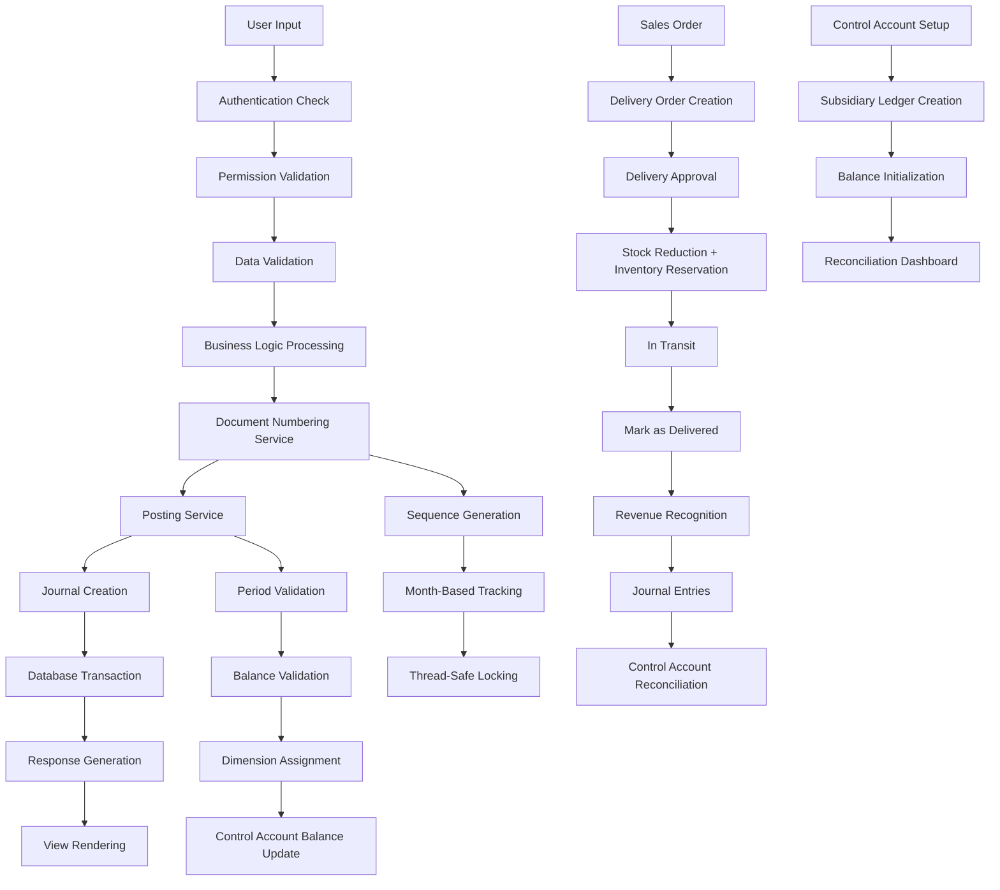
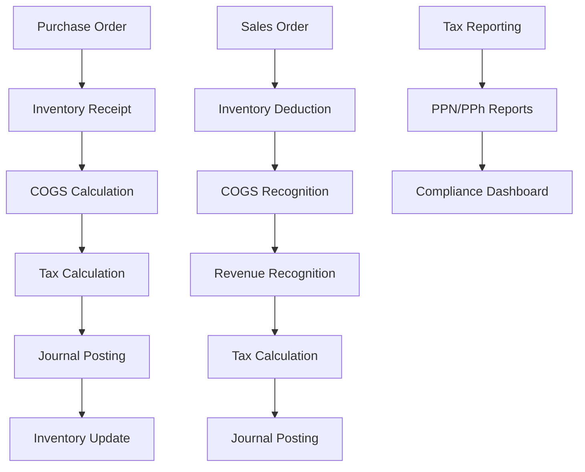

Purpose: Technical reference for understanding system design and development patterns
Last Updated: 2026-02-13 (Delivery Order Simplified Flow & Mark as Delivered)

## Architecture Documentation Guidelines

### Document Purpose

This document describes the CURRENT WORKING STATE of the application architecture. It serves as:

-   Technical reference for understanding how the system currently works
-   Onboarding guide for new developers
-   Design pattern documentation for consistent development
-   Schema and data flow documentation reflecting actual implementation

### What TO Include

-   **Current Technology Stack**: Technologies actually in use
-   **Working Components**: Components that are implemented and functional
-   **Actual Database Schema**: Tables, fields, and relationships as they exist
-   **Implemented Data Flows**: How data actually moves through the system
-   **Working API Endpoints**: Routes that are active and functional
-   **Deployment Patterns**: How the system is actually deployed
-   **Security Measures**: Security implementations that are active

### What NOT to Include

-   **Issues or Bugs**: These belong in `MEMORY.md` with technical debt entries
-   **Limitations or Problems**: Document what IS working, not what isn't
-   **Future Plans**: Enhancement ideas belong in `backlog.md`
-   **Deprecated Features**: Remove outdated information rather than marking as deprecated
-   **Wishlist Items**: Planned features that aren't implemented yet

### Update Guidelines

-   **Reflect Reality**: Always document the actual current state, not intended state
-   **Schema Notes**: When database schema has unused fields, note them factually
-   **Cross-Reference**: Link to other docs when appropriate, but don't duplicate content

### For AI Coding Agents

-   **Investigate Before Updating**: Use codebase search to verify current implementation
-   **Move Issues to Memory**: If you discover problems, document them in `MEMORY.md`
-   **Factual Documentation**: Describe what exists, not what should exist

---

# Sarange ERP System Architecture

## Project Overview

Sarange ERP is a comprehensive Enterprise Resource Planning system built with Laravel 12, designed for Indonesian businesses. It provides complete financial management, fixed asset management, procurement, sales, and reporting capabilities with role-based access control and multi-dimensional accounting.

## Current System Status

**Production Readiness**: 95% Complete ✅  
**Last Comprehensive Testing**: 2025-09-21  
**Testing Status**: Complete end-to-end validation successful

### Validated Functionality

-   ✅ **Inventory Management**: Complete CRUD operations, multi-category support, validation, low stock alerts, and valuation report pages rendering without backend errors (routes correctly prioritise static report URLs over item detail routes and low stock logic uses warehouse stock quantities)
-   ✅ **Purchase Workflow**: PO → GRPO → PI → PP complete workflow validated
-   ✅ **Sales Workflow**: SO → DO → SI → SR complete workflow validated
-   ✅ **Financial Integration**: Automatic document numbering, tax calculations, journal entries
-   ✅ **User Interface**: Professional AdminLTE integration, responsive design, form validation
-   ✅ **Data Management**: Business partner consolidation, field mapping resolution, data persistence

### Critical Issues Resolved

-   ✅ Field mapping issues (business_partner_id vs vendor_id/customer_id)
-   ✅ DocumentClosureService import issues and missing models
-   ✅ View template references (customers → business_partners)
-   ✅ Form submission failures and validation errors

## Technology Stack

-   **Backend**: Laravel 12 (PHP 8.2+)
-   **Frontend**: Blade templates with AdminLTE 3.14, jQuery, DataTables, SweetAlert2
-   **Database**: MySQL with comprehensive schema (51 migrations)
-   **Authentication**: Laravel Auth with Spatie Permission package
-   **PDF Generation**: DomPDF for document printing
-   **Excel Export**: Laravel Excel (Maatwebsite)
-   **UI Framework**: AdminLTE 3 with Bootstrap 4
-   **Timezone**: Asia/Singapore (configured)

## Navigation Structure

The system uses a hierarchical sidebar navigation structure optimized for trading company operations:

### Main Navigation Sections

1. **Dashboard** - System overview and key metrics
2. **MAIN** - Core business operations (ordered by business process flow):
    - **Inventory** - Item management, stock levels, valuation reports, low stock alerts
    - **Purchase** - Dashboard, purchase orders, goods receipts, purchase invoices, purchase payments
    - **Sales** - Dashboard, sales orders, delivery orders, sales invoices, sales receipts
    - **Fixed Assets** - Asset categories, assets, depreciation, disposals, movements, import, data quality, bulk operations
    - **Business Partner** - Unified customer and supplier management with tabbed interface
    - **Accounting** - Journals, cash expenses, accounts, periods
    - **Master Data** - Projects, departments
3. **REPORTS** - Comprehensive reporting modules
4. **ADMIN** - User management, roles and permissions

### Navigation Features

-   **Role-Based Access**: Menu items are conditionally displayed based on user permissions
-   **Active State Management**: Current page highlighting and menu expansion
-   **Responsive Design**: Collapsible sidebar with mobile-friendly navigation
-   **Icon Integration**: FontAwesome icons for visual navigation cues
-   **Breadcrumb Navigation**: Page-level breadcrumb trails for deep navigation
-   **Menu Search Bar**: Global search functionality in navbar for quick menu item discovery and navigation with permission-aware filtering, keyboard navigation (Arrow keys, Enter, Escape), and real-time autocomplete results

## Core Components

### 1. Financial Management System

-   **Chart of Accounts**: Hierarchical account structure with 5 types (asset, liability, net_assets, income, expense)
-   **Journal Management**: Manual journal entries with entity-aware numbering (code 12) and multi-currency support, entity resolution from source documents
-   **Period Management**: Financial period closing with validation
-   **Posting Service**: Centralized accounting posting with balance validation and foreign currency handling

### Dashboard Aggregation Layer

-   **DashboardDataService**: Consolidates KPI metrics, finance aging, sales/procurement stats, inventory insights, asset snapshots, compliance signals, and configuration alerts into a single cached payload (300s TTL) for the AdminLTE dashboard.
-   **DashboardController**: Injects the aggregated payload into `dashboard.blade.php`, supports `?refresh=1` to bypass cache, and keeps route logic slim.
-   **Blade Layout**: Rebuilt to consume the structured payload, rendering KPI info boxes, finance cards, inventory tables, and compliance alerts without inline database calls while respecting existing permission checks for fixed asset panels.
-   **Purchase Dashboard**: Comprehensive purchase analytics with `PurchaseDashboardDataService` providing AP aging analysis, purchase order statistics, purchase invoice statistics, goods receipt statistics, supplier statistics, and recent invoices with 300s TTL caching.
-   **Sales Dashboard**: Comprehensive sales analytics with `SalesDashboardDataService` providing AR aging analysis, sales order statistics, sales invoice statistics, delivery order statistics, customer statistics, and recent invoices with 300s TTL caching.
-   **Account Statements**: Comprehensive financial statements for GL accounts and Business Partners with transaction tracking and running balances
-   **Control Account System**: Enterprise-level control account architecture with automatic balance tracking, subsidiary ledger management, and reconciliation dashboard for financial control and compliance
-   **Entity-Aware Numbering System**: Centralized document numbering service with universal EEYYDDNNNNN format across all document types

### 1.1. Multi-Currency Management System

-   **Currency Master**: Support for multiple currencies with IDR as base currency, including USD, SGD, EUR, CNY, JPY, MYR, AUD, GBP, HKD
-   **Exchange Rate Management**: Daily exchange rate entry with automatic inverse rate calculation and historical rate tracking
-   **Foreign Currency Transactions**: All financial documents support foreign currency with automatic IDR conversion using exchange rates
-   **Dual Currency Reporting**: Financial reports display both foreign currency amounts and IDR equivalents
-   **FX Gain/Loss Tracking**: Automatic calculation and posting of realized and unrealized foreign exchange gains/losses
-   **Currency Revaluation**: Periodic revaluation of foreign currency balances with journal entry generation
-   **Multi-Currency Forms**: Purchase Orders, Sales Orders, and Journal Entries support currency selection with real-time exchange rate updates

### 2. Accounts Receivable (AR) Module

-   **Sales Dashboard**: Comprehensive sales analytics dashboard with AR aging analysis, sales KPIs (Sales MTD, Outstanding AR, Pending Approvals, Open Sales Orders), sales order statistics, sales invoice statistics, delivery order statistics, top customers by outstanding AR, and recent invoices visualization.
-   **Sales Invoices**: Customer billing with line items, tax codes, and dimensions (SINV-YYYYMM-######)
-   **Sales Receipts**: Payment collection with automatic allocation to invoices (SR-YYYYMM-######)
-   **Sales Orders**: Customer order management with entity-aware numbering (code 06)
-   **AR Aging**: Customer payment tracking and aging analysis with buckets (Current, 1-30, 31-60, 61-90, 90+ days) calculated from sales invoices minus sales receipt allocations
-   **AR Balances**: Customer account balance reporting

### 3. Accounts Payable (AP) Module

-   **Purchase Dashboard**: Comprehensive purchase analytics dashboard with AP aging analysis, purchase KPIs (Purchases MTD, Outstanding AP, Pending Approvals, Open Purchase Orders), purchase order statistics, purchase invoice statistics, goods receipt statistics, top suppliers by outstanding AP, and recent invoices visualization.
-   **Purchase Invoices**: Vendor billing with line items and tax handling (PINV-YYYYMM-######)
-   **Purchase Payments**: Vendor payment processing with allocation (PP-YYYYMM-######)
-   **Purchase Orders**: Vendor order management with automatic numbering (PO-YYYYMM-######)
-   **Goods Receipt PO**: Purchase Order-based inventory receipt processing with automatic numbering (GR-YYYYMM-######)
-   **AP Aging**: Vendor payment tracking and aging analysis with buckets (Current, 1-30, 31-60, 61-90, 90+ days) calculated from purchase invoices minus purchase payment allocations
-   **AP Balances**: Vendor account balance reporting

### 4. Enhanced Inventory Management System

#### 4.1. Dual-Type Inventory System

-   **Item Types**: Support for both physical items and services with item_type field
-   **Order Types**: Purchase and Sales orders support both item and service types
-   **Inventory Impact**: Only 'item' type affects stock quantities, 'service' type bypasses inventory
-   **Document Flow**:
    -   Item PO → GRPO → Sales Invoice (with multi-GRPO combination)
    -   Service PO → Purchase Invoice (direct, no GRPO needed)
-   **Type Validation**: Prevents mixing item/service types within same order
-   **Numbering**: Different prefixes for copied documents (GRPO vs GR)

#### 4.2. Item Category Account Mapping System

-   **Account Integration**: Each product category maps to 3 specific accounts:
    -   **Inventory Account**: For inventory valuation (e.g., "Inventory - Stationery")
    -   **COGS Account**: For cost of goods sold (e.g., "COGS - Stationery")
    -   **Sales Account**: For revenue recognition (e.g., "Sales - Stationery")
-   **Automatic Mapping**: Items inherit account mappings from their category
-   **Account Inheritance**: Sub-categories can inherit accounts from parent categories if not explicitly set
-   **Service Categories**: Support for service-only categories without inventory accounts
-   **CRUD Interface**: Complete Product Category management system with:
    -   **ProductCategoryController**: Full CRUD operations with validation and hierarchical support
    -   **AdminLTE Views**: Index with table/tree view toggle, create, show, edit views with proper form handling
    -   **Account Selection**: Dropdown interfaces for selecting inventory, COGS, and sales accounts
    -   **Hierarchical Support**: Full parent-child category relationships with account inheritance
    -   **Hierarchical Display**: Categories display with full path (e.g., "Parent > Child > Grandchild") in dropdowns
    -   **Tree View**: Visual hierarchical tree display with color-coded levels and expandable structure
    -   **Parent Selection**: Only root categories shown as potential parents to prevent circular references
    -   **Audit Integration**: Complete audit trail for category changes
    -   **Menu Integration**: Accessible via Master Data → Product Categories
-   **Model Methods**: `getHierarchicalName()`, `getHierarchicalPath()`, `isRoot()`, `getDescendants()`, `getInvalidParentIds()` for hierarchical operations
-   **Sample Categories**: Welding, Electrical, Otomotif, Lifting Tools, Consumables, Stationery, Electronics, Chemical, Bolt Nut, Safety, Tools with proper account mappings

#### 4.3. Multi-Warehouse Management

-   **Warehouse Master Data**: Complete warehouse information with contact details and status
-   **Per-Warehouse Stock Tracking**: Individual stock levels for each item-warehouse combination
-   **Default Warehouse Assignment**: Items can have default warehouses for automatic assignment
-   **Stock Transfers**: Inter-warehouse stock transfer capabilities with full audit trail. Dedicated transfer page (`/warehouses/transfer`) with custom Bootstrap autocomplete search for efficient item selection from large inventories (case-insensitive search by code or name, debounced AJAX, keyboard navigation, search term highlighting), comprehensive stock information display (source warehouse stock, destination warehouse stock, after-transfer projections), and real-time stock updates with validation alerts
-   **Warehouse-Specific Reorder Points**: Different reorder points per warehouse
-   **Sample Warehouses**: Main Warehouse, Branch Warehouse, Storage Facility
-   **Stock Accuracy Verification**: `php artisan inventory:check-accuracy {item_code?}` command verifies accuracy between `current_stock` (from transactions) and sum of warehouse stock records, showing detailed breakdown including transaction analysis and warehouse allocation
-   **Stock Reconciliation**: `php artisan inventory:reconcile-warehouse-stock {item_code?} {--warehouse_id=}` command reconciles warehouse stock from transactions, allocating stock to warehouses for transactions missing `warehouse_id` and creating/updating warehouse stock records to ensure `current_stock` equals sum of warehouse stock records

#### 4.4. Sales Price Level System

-   **Three Price Levels**: Level 1 (default), Level 2, Level 3 with flexible pricing
-   **Customer Assignment**: Customers can have default price levels
-   **Item-Specific Pricing**: Individual items can have different prices for each level
-   **Percentage-Based Calculations**: Support for percentage-based price calculations
-   **Customer Overrides**: Customer-specific price overrides for individual items
-   **Flexible Pricing**: Both fixed prices and percentage-based calculations supported
-   **UI Entry Points**: Price levels are configured on the Inventory Item create/edit forms and resolved at runtime via AJAX when selecting items and customers on Sales documents

#### 4.5. Comprehensive Audit Trail System

-   **System-Wide Tracking**: Complete audit trail for all inventory-related changes
-   **Change Tracking**: Old and new values captured for all modifications
-   **User Attribution**: Full user tracking with IP address and user agent
-   **Entity-Specific Logs**: Separate audit trails for items, transactions, warehouses
-   **Action Types**: Created, Updated, Deleted, Approved, Rejected, Transferred, Adjusted
-   **Search and Filtering**: Comprehensive audit log management with filtering capabilities
-   **Current Status**: Foundation implemented (database schema, model, service, controller, routes) - See `docs/audit-trail-analysis-and-recommendations.md` for detailed analysis and 5-phase implementation plan
-   **Implementation Plan**:
    -   Phase 1: Complete Core UI (2-3 days) - Create missing views, sidebar integration, DataTables
    -   Phase 2: Automatic Logging (2-3 days) - Model Observers, Auditable trait, comprehensive model integration
    -   Phase 3: Module Integration (5-8 days) - Workflow logging (Purchase/Sales/Accounting), Business Partner activity, Fixed Asset lifecycle
    -   Phase 4: Enhanced Features (6-10 days) - Activity dashboard, advanced filtering, export/reporting, inline widgets
    -   Phase 5: Optimization (5-9 days) - Log archiving, retention policies, performance optimization
-   **Documentation**: Detailed action plans available in `docs/audit-trail-phase1-detailed-action-plan.md` through `docs/audit-trail-phase4-detailed-action-plan.md`

### 5. Fixed Asset Management

-   **Asset Register**: Complete asset lifecycle management
-   **Asset Categories**: Configurable categories with depreciation settings
-   **Depreciation Management**: Automated depreciation calculation and posting
-   **Asset Disposal**: Disposal process with gain/loss calculation and entity-aware numbering (code 10)
-   **Asset Movement**: Transfer tracking between departments/projects
-   **Data Quality**: Duplicate detection, completeness checks, consistency validation

### 5. Procurement Management

-   **Purchase Orders**: Vendor order management with approval workflow (PO-YYYYMM-######)
-   **Goods Receipt PO**: Purchase Order-based inventory receipt processing (GR-YYYYMM-######)
-   **Vendor Management**: Vendor master data with performance tracking

#### 5.0 Approval Workflow Management System

-   **Workflow Configuration**: Admin UI for creating and managing approval workflows by document type (Purchase Order, Sales Order)
-   **Workflow Steps**: Configurable sequential approval steps with role assignments (Officer, Supervisor, Manager)
-   **Approval Thresholds**: Amount-based threshold configuration determining required approval levels
-   **Threshold Management**: Create, edit, and delete approval thresholds with overlap validation
-   **Workflow Steps Management**: Dynamic step addition/removal with step order, role, approval type (Sequential/Parallel), and required flag
-   **Admin Interface**: Complete CRUD operations with DataTables integration, modal-based threshold management, and comprehensive validation
-   **Database Schema**: `approval_workflows`, `approval_workflow_steps`, `approval_thresholds` tables with proper relationships
-   **Service Integration**: ApprovalWorkflowService integration with PurchaseService and SalesService for automatic workflow creation
-   **Default Configuration**: ApprovalWorkflowSeeder provides default workflows and thresholds for purchase_order and sales_order document types

#### 5.1 Goods Receipt PO System Architecture

-   **Vendor-First Workflow**: Users must select vendor before accessing Purchase Orders, ensuring data consistency
-   **Dynamic PO Filtering**: AJAX-powered Purchase Order dropdown filtered by selected vendor and remaining quantities
-   **Copy Remaining Lines**: Automated copying of Purchase Order lines with remaining quantities (pending_qty > 0)
-   **Smart Quantity Calculation**: Automatic calculation of remaining quantities (PO qty - received qty) for accurate line population
-   **Remaining Quantity Display**: Dedicated "Remaining Qty" column in GRPO lines table showing pending quantities from source PO
-   **PO-Based Item Filtering**: Item selection modal filters items to show only those from selected PO with remaining quantities
-   **Enhanced User Interface**: Simplified interface for warehouse users with financial columns removed (amount, VAT, WTax)
-   **Intelligent Item Selection**: Modal displays items with "From PO" category and remaining quantities in stock column
-   **Database Schema**: goods_receipt_po and goods_receipt_po_lines tables with proper foreign key relationships
-   **Model Structure**: GoodsReceiptPO and GoodsReceiptPOLine models with comprehensive relationships
-   **Controller Architecture**: GoodsReceiptPOController with AJAX endpoints for vendor-specific PO retrieval and line copying
-   **Route Structure**: goods-receipt-pos.\* routes with enhanced AJAX endpoints (/vendor-pos, /remaining-lines)
-   **JavaScript Enhancement**: Dynamic form handling with vendor selection triggering PO filtering, copy functionality, and item filtering
-   **User Interface**: Professional AdminLTE integration with enhanced form controls, remaining quantity tracking, and guided user experience
-   **Inventory Transaction Creation**: Automatic inventory transaction creation when GRPO is created or received using `InventoryService::processPurchaseTransaction()` with reference_type='goods_receipt_po', ensuring complete audit trail and proper stock tracking
-   **Retroactive Fix Support**: `fixInventoryTransactions()` method available for existing GRPOs that were created before inventory transaction creation was implemented

### 6. Sales Management

-   **Sales Orders**: Customer order management (SO-YYYYMM-######) with approval workflow, inventory item display, and auto-recovery for missing approval records
-   **Delivery Orders**: Delivery management with inventory reservation and revenue recognition (DO-YYYYMM-######)
-   **Customer Management**: Customer master data with credit management

#### 6.0 Sales Order Approval Workflow System

-   **Approval Workflow**: Multi-level approval process (Officer, Supervisor, Manager) based on order amount thresholds
-   **Auto-Recovery Mechanism**: `SalesService::approveSalesOrder()` automatically creates missing approval records if they don't exist, preventing approval failures
-   **Approval Records**: `sales_order_approvals` table stores individual approval records with user_id, approval_level, status (pending/approved/rejected), and comments
-   **Status Progression**: Draft → Pending Approval → Ordered (when all approvals complete)
-   **Fix Commands**: `php artisan sales-order:fix-approval {orderNo}` or `--all` to bulk-fix Sales Orders with missing approval records
-   **Role Management**: `php artisan role:ensure-officer` command ensures "officer" role exists in both Spatie Permission system and approval workflow system
-   **Fix Route**: `/sales-orders/fix-approval/{orderNo}` for ad-hoc approval workflow fixes
-   **Dual Role System**: Approval workflows use `user_roles` table (officer/supervisor/manager) while UI displays Spatie Permission roles from `roles` table

#### 6.1 Sales Order Display Enhancement

-   **Item Code Column**: Displays inventory item code from `inventory_items.code` via relationship, falls back to `sales_order_lines.item_code` if relationship unavailable
-   **Item Name Column**: Displays inventory item name from `inventory_items.name` via relationship, falls back to `sales_order_lines.item_name` if relationship unavailable
-   **Eager Loading**: `SalesOrderController::show()` eager loads `lines.inventoryItem` relationship for optimal performance
-   **Data Consistency**: Prefers relationship data over denormalized fields for accurate inventory information display

### 6.1. Warehouse Selection System

-   **Comprehensive Warehouse Integration**: Warehouse selection functionality across all order types (Purchase Orders, Goods Receipt PO, Sales Orders, Delivery Orders) with required field validation
-   **Single Warehouse Selection**: Each order type supports single warehouse selection (destination warehouse for POs, source warehouse for SOs, single warehouse for DOs)
-   **GRPO Default Logic**: Goods Receipt PO defaults to the original Purchase Order's warehouse but allows manual changes for flexibility
-   **Transit Warehouse Filtering**: Automatic filtering of transit warehouses from manual selection dropdowns since transit warehouses are only used for automatic ITO/ITI activities
-   **Database Schema Integration**: warehouse_id foreign key fields added to all order tables with proper constraints and relationships
-   **Model Relationships**: BelongsTo relationships between order models and Warehouse model with proper fillable field configuration
-   **Controller Validation**: Comprehensive validation rules ensuring warehouse_id is required and exists in warehouses table
-   **View Integration**: Professional warehouse selection dropdowns using Select2BS4 with active warehouse filtering and proper error handling
-   **Service Layer Support**: Service methods updated to handle warehouse_id parameter passing and business logic integration
-   **Transit Warehouse Logic**: Transit warehouses follow naming convention (e.g., WH001_TRANSIT for WH001) and are automatically used in ITO/ITI operations based on source warehouse

### 6.2. GR/GI Management System

-   **Goods Receipt (GR)**: Non-purchase receiving operations with automatic journal integration
-   **Goods Issue (GI)**: Non-sales issuing operations with FIFO/LIFO/Average cost valuation
-   **Purpose Management**: Configurable GR/GI purposes (Customer Return, Donation, Sample, etc.)
-   **Account Mapping**: Automatic account mapping based on item categories and purposes
-   **Approval Workflow**: Draft → Pending Approval → Approved status progression
-   **Inventory Transaction Creation**: Automatic inventory transaction creation when GR/GI is approved using `GRGIService::updateWarehouseStock()` with reference_type='gr_gi', proper unit cost calculation, and item valuation updates
-   **Retroactive Fix Support**: `fixInventoryTransactions()` method available for existing GR/GI documents that were approved before inventory transaction creation was implemented
-   **Quantity Display Format**: Quantity column displays with 2 decimal places for consistency
-   **Journal Integration**: Automatic journal entry creation on document approval via PostingService integration (GR: Debit=item category account, Credit=purpose account; GI: Debit=purpose account, Credit=item category account)
-   **PostingService Integration**: GRGIService uses centralized PostingService for journal creation, ensuring consistent journal schema, entity resolution, currency handling, and control account balance updates
-   **Valuation Methods**: Multiple cost calculation methods (FIFO, LIFO, Average, Manual)
-   **SweetAlert2 Integration**: Professional confirmation dialogs for critical operations
-   **Seeder Requirements**: GRGIPurposeSeeder and GRGIAccountMappingSeeder must be run for system initialization

### 6.3. Delivery Order System

-   **Simplified Flow**: Draft → Approve → In Transit → Mark as Delivered → Completed. Picking step removed; stock reduces at approval. `DeliveryService::approveDeliveryOrder()` sets status to `in_transit`, auto-sets `picked_qty = ordered_qty` per line, calls `reduceStockOnApproval()` for inventory sale transactions, and creates inventory reservation journal. `markAsDelivered()` creates revenue recognition journal and sets status to `completed`.
-   **Multiple Partial DOs per SO**: A Sales Order can have multiple Delivery Orders. `DeliveryService::getDeliveredQtyForSalesOrderLineExcludingDo()` sums `delivered_qty` from non-cancelled DO lines (optionally excluding current DO); `syncSalesOrderLineFromDeliveries()` updates `SalesOrderLine.delivered_qty`. New DO creation uses remaining qty = SO qty - allocated; `getRemainingLinesForSalesOrder()` returns `ordered_qty`, `remaining_qty`, `max_qty` per line (Remain Qty = SO qty - delivered by other DOs).
-   **Delivery Items Table**: Columns No, Item Code, Item Name, Ordered Qty (SO line original), Remain Qty (SO - delivered by others, read-only), Delivery Qty (qty for this DO, editable when draft), Action (edit/delete when draft). VAT, WTax, Unit Price hidden from create/edit/show/print (kept in DB for invoicing).
-   **Inventory Stock Reduction**: Stock reduces at **approval** via `reduceStockOnApproval()` (not at pick). `DeliveryService::processSaleTransaction()` creates inventory sale transactions for `ordered_qty` per line. Reversal via `processAdjustmentTransaction` when DO is cancelled with picked_qty > 0.
-   **Mark as Delivered**: Single button with modal (date, time, delivered by). `markAsDelivered()` sets `delivered_at`, `delivered_by`, `actual_delivery_date`; sets all line `delivered_qty = ordered_qty`; syncs SO lines; creates revenue recognition journal via `DeliveryJournalService::createRevenueRecognition()`; sets status to `completed`. `delivery_orders` table has `delivered_at` (datetime) and `delivered_by` (string).
-   **Journal Flow**: Approve → Inventory Reservation journal (DR Inventory Reserved, CR Inventory Available). Mark as Delivered → Revenue Recognition journal (Revenue, COGS, AR UnInvoice, release Inventory Reserved). Complete Delivery step removed; revenue recognition merged into Mark as Delivered.
-   **Status Tracking**: draft, in_transit, ready, delivered (transient), completed, cancelled. Picking, packed, partial_delivered statuses no longer used in new flow.
-   **Approval Workflows**: Multi-level approval process with proper authorization controls
-   **Delivery Tracking**: Logistics cost tracking, performance metrics, and customer satisfaction monitoring
-   **Print Functionality**: Professional delivery order documents (No, Item Code, Item Name, Delivery Qty)
-   **Data Integrity**: Foreign key constraint handling with graceful NULL assignment when inventory items are deleted
-   **Sales Order Integration**: Customer-based filtering for Sales Order selection. Create Delivery Order available when SO status is `confirmed` or `processing`.
-   **Item Display**: Fallback chain for displaying item information (item_code → inventoryItem->code, description → inventoryItem->name → item_name)
-   **Backfill Command**: `php artisan delivery-orders:backfill-inventory-transactions` with `--dry-run` for existing DO lines with picked/delivered qty but no inventory transactions

### 7. Control Account Management System

-   **Control Accounts**: Summary accounts representing totals of subsidiary ledger groups (AR Control, AP Control, Inventory Control, Fixed Assets Control)
-   **Subsidiary Ledger Management**: Individual subsidiary accounts linked to control accounts (Business Partners, Inventory Items, Fixed Assets)
-   **Automatic Balance Tracking**: Real-time balance updates through PostingService integration
-   **Reconciliation Dashboard**: Comprehensive reconciliation interface with variance detection and exception reporting
-   **Multi-Dimensional Support**: Control account balances tracked by project and department dimensions
-   **Exception Reporting**: Automatic identification of accounts with variances above tolerance levels
-   **Audit Trail**: Complete transaction history and reconciliation tracking

### 8. Corrected Accounting Flow with Intermediate Accounts

-   **Intermediate Accounts**: AR UnInvoice (1.1.2.04) and AP UnInvoice (2.1.1.03) for proper accrual accounting
-   **GRPO Accounting**: Debit Inventory Account, Credit AP UnInvoice (goods received but not yet invoiced)
-   **Purchase Invoice Accounting (Credit)**: Debit AP UnInvoice, Credit Utang Dagang (liability transfer from intermediate to final)
-   **Purchase Invoice Accounting (Direct Cash)**: Debit Inventory Account, Credit Cash Account (immediate cash payment, no Purchase Payment needed)
-   **Purchase Payment Accounting**: Debit Utang Dagang, Credit Cash (liability settlement for credit purchases)
-   **Delivery Order Accounting**: Debit AR UnInvoice, Credit Revenue (goods delivered but not yet invoiced)
-   **Sales Invoice Accounting**: Debit AR UnInvoice, Credit Piutang Dagang (receivable transfer from intermediate to final)
-   **Sales Receipt Accounting**: Debit Cash, Credit Piutang Dagang (receivable settlement)
-   **Automatic Journal Generation**: All transactions automatically create balanced journal entries
-   **Account Mapping Logic**: Inventory accounts mapped by item categories, liability/receivable accounts by business partner type
-   **Direct Cash Purchase Flow**: Simplified workflow (PI → Post) for immediate cash purchases with automatic inventory transaction creation and cash account selection support

### 9. Multi-Dimensional Accounting

-   **Projects**: Project-based cost tracking
-   **Departments**: Departmental cost allocation

### 10. Reporting & Analytics

-   **Trial Balance**: Real-time financial position reporting
-   **GL Detail**: Detailed general ledger with filtering
-   **Cash Ledger**: Cash flow tracking and reporting
-   **Asset Reports**: Comprehensive asset reporting suite
-   **AR/AP Reports**: Customer and vendor analysis
-   **Withholding Tax**: Tax reporting and compliance

### 10. Indonesian Tax Compliance System

-   **Tax Transaction Management**: Comprehensive tracking of all tax transactions (PPN, PPh 21-26, PPh 4(2))
-   **Tax Period Management**: Monthly/quarterly/annual tax period management with status tracking
-   **Tax Report Generation**: Automatic SPT (Surat Pemberitahuan Tahunan) report generation
-   **Tax Settings Configuration**: Configurable tax rates, company information, and reporting preferences
-   **Compliance Monitoring**: Overdue tracking, audit trail, and compliance status monitoring
-   **Integration**: Automatic tax calculation with purchase/sales systems

### 11. Advanced Trading Analytics System (Phase 4)

-   **COGS Foundation**: Comprehensive Cost of Goods Sold tracking with multiple valuation methods (FIFO, LIFO, Weighted Average)
-   **Cost Allocation**: Automatic cost allocation across products, customers, and suppliers with configurable methods
-   **Margin Analysis**: Real-time profitability analysis with gross and net margin calculations
-   **Supplier Analytics**: Performance tracking, cost optimization, risk assessment, and supplier ranking
-   **Business Intelligence**: Advanced analytics with insights generation, recommendations engine, and KPI tracking
-   **Unified Dashboard**: Integrated analytics platform combining all trading components for comprehensive decision making

### 12. User Management & Security

-   **Role-Based Access Control**: Granular permission system
-   **User Management**: Complete user lifecycle management
-   **Permission Management**: Fine-grained access control
-   **Session Management**: Secure authentication and session handling

### 13. Training & Documentation System

-   **Comprehensive Training Materials**: Complete 3-day training workshop package with 9 comprehensive documents
-   **Module-Based Training**: 7 specialized training modules covering all major system components
-   **Story-Based Learning**: 35+ realistic business scenarios with hands-on exercises
-   **Assessment Framework**: Multi-level evaluation system with certification levels (Basic, Intermediate, Advanced, Expert)
-   **Indonesian Business Context**: All training materials tailored for Indonesian trading company operations
-   **Implementation Guidelines**: Detailed delivery structure, success metrics, and post-training support

### 14. Business Partner Management System

-   **Unified Partner Management**: Single interface for managing customers and suppliers with partner_type classification (customer, supplier)
-   **Default Currency Assignment**: Business partners automatically receive base currency (IDR) as default when `default_currency_id` is not provided during creation or update, ensuring data integrity and preventing null currency issues
-   **Account Mapping**: Business partners can be assigned specific GL accounts with automatic default assignment (Customer→AR, Supplier→AP)
-   **Conditional Relationship Loading**: BusinessPartnerService conditionally loads relationships (purchaseOrders, salesOrders, purchaseInvoices, salesInvoices) only if corresponding database tables exist, preventing errors during schema evolution or partial migrations
-   **Defensive View Logic**: Blade views verify both table existence (`Schema::hasTable()`) and relationship loading status (`relationLoaded()`) before accessing relationship data, ensuring graceful handling of missing tables or relationships
-   **Journal History**: Comprehensive transaction history with running balance calculation, multi-source data consolidation, and pagination
-   **Tabbed Interface**: Organized partner data across General Information, Contact Details, Addresses, Taxation & Terms (with Accounting section), Banking & Financial, Transactions, and Account Balance - Journal History sections
-   **Flexible Data Storage**: BusinessPartnerDetail model enables custom field storage without schema changes
-   **Multiple Contacts**: Support for multiple contact persons per partner with different contact types (primary, billing, shipping, technical, sales, support)
-   **Multiple Addresses**: Support for multiple addresses per partner with different address types (billing, shipping, registered, warehouse, office)
-   **Transaction Consolidation**: BusinessPartnerJournalService consolidates transactions from journal lines, sales/purchase invoices/receipts
-   **Backward Compatibility**: Maintained compatibility with existing PurchaseOrder, SalesOrder, and DeliveryOrder models
-   **Data Migration**: Comprehensive migration from separate customers and vendors tables to unified business_partners structure
-   **Field Mapping Consistency**: All controllers, services, forms, and JavaScript use business_partner_id consistently across the entire ERP system
-   **Form Submission Integrity**: All forms submit correctly with proper field validation and JavaScript handling

### 15. Master Data Management System

-   **Projects Management**: Project-based cost tracking with comprehensive CRUD operations
-   **Departments Management**: Departmental cost allocation and organizational structure management
-   **SweetAlert2 Integration**: Consistent confirmation dialogs and success notifications across all Master Data features
-   **JSON API Responses**: Proper AJAX handling with JSON success/error responses for seamless user experience
-   **DataTable Integration**: Dynamic data loading with search, sorting, and pagination capabilities

### 16. Comprehensive Entity-Aware Document Numbering System

-   **Centralized Service**: DocumentNumberingService provides unified entity-aware document numbering across all document types
-   **Universal Entity Format**: All document types now use `EEYYDDNNNNN` format (Entity code, 2-digit year, document code, 5-digit sequence)
    -   **Format Breakdown**: `EE` (2-digit entity code) + `YY` (2-digit year) + `DD` (2-digit document code) + `NNNNN` (5-digit sequence)
    -   **Example**: `71250100001` = PT CSJ (71) + 2025 (25) + Purchase Order (01) + Sequence 00001
-   **Document Code Assignment**:
    -   PO `01`, GRPO `02`, PI `03`, Purchase Payment `04`, Sales Order `06`, DO `07`, SI `08`, Sales Receipt `09`
    -   Asset Disposal `10`, Cash Expense `11`, Journal `12`, Account Statement `13`
-   **Entity Resolution**:
    -   Purchase/Sales documents: Inherit entity from document creator or base document (PO→GRPO, SO→DO)
    -   Asset Disposal: Resolve from Asset→PurchaseInvoice entity chain, fallback to default
    -   Cash Expense/Journal/Account Statement: Use default entity
    -   Manual Journals: Default entity assignment
-   **Thread-Safe Operations**: Database transactions with proper locking prevent duplicate numbers
-   **Year-Based Sequences**: Automatic sequence reset on January 1st per entity/document type/year
-   **Sequence Management**: DocumentSequence model tracks last sequence per-entity/per-document/per-year (`company_entity_id`, `document_code`, `year`, `current_number`)
-   **Legacy Format**: PREFIX-YYYYMM-###### format is completely deprecated
-   **Error Handling**: Comprehensive exception handling, validation, and entity resolution
-   **Database Persistence**: Sequence tracking stored in document_sequences table with unique composite keys
-   **CompanyEntityService Integration**: Automatic entity resolution, default entity fallback, and entity context propagation

### 17. Document Closure System

-   **Document Lifecycle Management**: Comprehensive tracking of document status (open/closed) throughout business workflows
-   **Automatic Closure Logic**: Documents automatically close when subsequent documents fulfill their requirements
-   **Closure Chain Management**: Purchase Orders closed by Goods Receipt PO, Goods Receipt PO closed by Purchase Invoices, Purchase Invoices closed by Purchase Payments, Sales Orders closed by Delivery Orders, Delivery Orders closed by Sales Invoices, Sales Invoices closed by Sales Receipts
-   **Partial Closure Support**: Documents can be partially fulfilled by multiple subsequent documents with quantity/amount tracking
-   **Manual Closure Override**: Permission-based manual closure and reversal capabilities for corrections and exceptions
-   **Closure Tracking**: Complete audit trail of closure events including closing document type, ID, timestamp, and user attribution
-   **ERP Parameters Configuration**: User-configurable business rules including overdue thresholds, auto-closure settings, and price difference handling
-   **Open Items Reporting**: Comprehensive reporting system for monitoring outstanding documents with aging analysis and exception identification
-   **Database Schema Enhancement**: Added closure_status, closed_by_document_type, closed_by_document_id, closed_at, and closed_by_user_id fields to all document tables
-   **Service Layer Architecture**: DocumentClosureService for closure logic and OpenItemsService for reporting with comprehensive business rule validation
-   **UI Integration**: Status indicators in DataTables, closure information in document views, and dedicated Open Items report interface
-   **Performance Optimization**: Database indexes on closure_status and closed_by fields for efficient querying

### 18. Unified Design System

-   **Consistent UI Patterns**: All create pages follow unified design standards with card-outline styling
-   **Professional Visual Design**: Enhanced headers with relevant icons, proper color schemes, and visual hierarchy
-   **Responsive Form Layouts**: 3-column responsive layouts with proper Bootstrap grid implementation
-   **Enhanced User Experience**: Select2BS4 integration for improved dropdown functionality with search capabilities
-   **Real-Time Calculations**: Automatic total calculations with Indonesian number formatting across all forms
-   **Professional Table Design**: Card-outline table sections with striped styling and proper action buttons
-   **Improved Navigation**: Consistent breadcrumb navigation and "Back" buttons across all pages
-   **Form Validation**: Comprehensive error handling with proper field indicators and validation messages
-   **Button Styling**: Consistent button design with FontAwesome icons and professional styling
-   **Page Structure**: Standardized page layout with proper sections, headers, and footers
-   **Accessibility**: Proper form labels, required field indicators, and semantic HTML structure

## Database Schema

### Core Tables (52 migrations total - consolidated from 51, plus Phase 3 tax compliance and Phase 4 advanced trading analytics)

#### Financial Tables

-   `accounts`: Chart of accounts with hierarchical structure
-   `journals`: Journal headers with entity-aware numbering (code 12) and multi-currency support (currency_id, exchange_rate, company_entity_id resolved from source documents)
-   `journal_lines`: Journal line items with dimensions and foreign currency amounts (currency_id, exchange_rate, debit_foreign, credit_foreign)
-   `periods`: Financial periods with close/open status
-   `account_statements`: Account statement headers with opening/closing balances, entity-aware numbering (code 13), `company_entity_id` for default entity assignment
-   `account_statement_lines`: Statement line items with transaction details and running balances
-   `control_accounts`: Control account definitions linking GL accounts to control types (AR, AP, Inventory, Fixed Assets)
-   `subsidiary_ledger_accounts`: Subsidiary ledger accounts linking individual entities to control accounts
-   `control_account_balances`: Control account balances with multi-dimensional accounting support (projects/departments)

#### Multi-Currency Tables

-   `currencies`: Currency master data with code, name, symbol, decimal places, and base currency flag
-   `exchange_rates`: Exchange rate management with from/to currency pairs, effective dates, rate types (daily/manual/custom), and source tracking
-   `currency_revaluations`: Currency revaluation headers for periodic FX adjustments
-   `currency_revaluation_lines`: Individual account revaluation details with original and revalued amounts

#### AR/AP Tables

-   `sales_invoices` / `sales_invoice_lines`: Customer billing with `company_entity_id` for letterhead/accounting context
-   `sales_receipts` / `sales_receipt_lines`: Customer payments with `company_entity_id`
-   `purchase_invoices` / `purchase_invoice_lines`: Vendor billing with `company_entity_id`
-   `purchase_payments` / `purchase_payment_lines`: Vendor payments with `company_entity_id`
-   `receipt_payment_allocations`: Payment allocation tracking

#### Asset Management Tables

-   `asset_categories`: Asset classification with depreciation rules
-   `assets`: Complete asset register with financial tracking
-   `asset_depreciation_entries`: Depreciation transaction history
-   `asset_depreciation_runs`: Depreciation batch processing
-   `asset_disposals`: Asset disposal transactions
-   `asset_movements`: Asset transfer tracking

#### Business Partner Tables

-   `business_partners`: Unified customer and supplier master data with partner_type classification (customer, supplier), account_id for GL account mapping, and default_currency_id (foreign key to currencies table) - automatically set to base currency (IDR) if not provided during creation or update via BusinessPartnerService
-   `business_partner_contacts`: Multiple contact persons per partner with contact types
-   `business_partner_addresses`: Multiple addresses per partner with address types
-   `business_partner_details`: Flexible custom field storage for partner-specific data
-   `tax_codes`: Tax configuration
-   `bank_accounts` / `bank_transactions`: Banking integration

#### Company Entity Tables

-   `company_entities`: Legal entity master data powering multi-letterhead workflows (code, legal name, NPWP/tax number, address, phone/email, website, logo_path, letterhead_meta JSON, is_active). Seeds include PT Cahaya Sarange Jaya (`code 71`) and CV Cahaya Saranghae (`code 72`) referencing logos in `public/logo_pt_csj.png` and `public/logo_cv_saranghae.png`.
-   `document_sequences`: Extended with `company_entity_id`, `document_code`, `year`, and `current_number` columns (plus nullable legacy fields) to support per-entity/per-document/per-year sequencing for the upcoming `EEYYDD99999` format.
-   `CompanyEntityService`: Central helper that lists active entities, resolves default entity context, and propagates `company_entity_id` when copying documents (PO → GRPO, SO → DO, DO → SI, etc.).

#### Order Management Tables

-   `sales_orders` / `sales_order_lines`: Sales order processing with order_type (item/service), business_partner_id, **company_entity_id** (letterhead + posting context), warehouse_id (single source warehouse), and document closure fields (closure_status, closed_by_document_type, closed_by_document_id, closed_at, closed_by_user_id)
-   `purchase_orders` / `purchase_order_lines`: Purchase order processing with order_type (item/service), business_partner_id, **company_entity_id**, warehouse_id (single destination warehouse), and document closure fields (closure_status, closed_by_document_type, closed_by_document_id, closed_at, closed_by_user_id)
-   `goods_receipt_po` / `goods_receipt_po_lines`: Purchase Order-based inventory receipt with source tracking (purchase_order_id), business_partner_id, **company_entity_id**, warehouse_id (defaults to PO's warehouse but allows changes), and document closure fields (closure_status, closed_by_document_type, closed_by_document_id, closed_at, closed_by_user_id)
-   `sales_invoice_grpo_combinations`: Multi-GRPO Sales Invoice tracking
-   `delivery_orders` / `delivery_order_lines`: Delivery order processing with inventory reservation, revenue recognition, business_partner_id, **company_entity_id**, warehouse_id (single warehouse), and document closure fields (closure_status, closed_by_document_type, closed_by_document_id, closed_at, closed_by_user_id)
-   `delivery_tracking`: Delivery tracking with logistics cost and performance metrics

#### GR/GI Management Tables

-   `gr_gi_purposes`: GR/GI purpose definitions with type (goods_receipt/goods_issue), code, name, description, and status
-   `gr_gi_headers`: GR/GI document headers with document_number, document_type, purpose_id, warehouse_id, transaction_date, reference_number, notes, total_amount, status, approval workflow fields (approved_by, approved_at, cancelled_by, cancelled_at), and audit fields
-   `gr_gi_lines`: GR/GI line items with header_id, item_id, quantity, unit_price, total_amount, and notes
-   `gr_gi_account_mappings`: Account mapping configuration linking purposes and item categories to debit/credit accounts for automatic journal entry generation
-   `gr_gi_journal_entries`: Journal entry tracking linking GR/GI documents to generated journal entries for audit trail and reconciliation

#### Document Relationship Management Tables

-   `document_relationships`: Polymorphic relationship storage for document connections supporting base/target document relationships across all document types with automatic relationship initialization from existing data
-   `document_analytics`: Usage tracking and performance analytics with user behavior analysis and system optimization data including comprehensive indexing for performance

#### Dimension Tables

-   `projects`: Project dimension for cost tracking
-   `departments`: Department dimension for cost allocation

#### Trading Company Tables (Phase 1-3)

-   `product_categories`: Hierarchical product categorization with account mapping (inventory_account_id, cogs_account_id, sales_account_id)
-   `inventory_items`: Product master data with pricing, stock levels, item_type (item/service), default_warehouse_id, and price levels (selling_price_level_2, selling_price_level_3, percentage fields)
-   `inventory_transactions`: Stock movement tracking with cost allocation and warehouse_id. All inventory-affecting documents (GRPO, GR/GI, Purchase Invoice, Sales Invoice, Delivery Order lines) create inventory transactions with proper reference_type and reference_id for complete audit trail and transaction history. Delivery Order lines use reference_type='delivery_order_line' when Picked Qty or Delivered Qty is updated. Transaction quantities are stored with sign: positive for purchases/adjustments, negative for sales. Stock calculation sums all transaction quantities (purchases + adjustments + sales) since sales are already negative.
-   `inventory_valuations`: Real-time inventory valuation with multiple methods. Valuations are automatically updated when transactions occur. Use `php artisan inventory:fix-valuation` command to correct any historical valuation records with incorrect quantities.
-   `warehouses`: Warehouse master data with contact information and status
-   `inventory_warehouse_stock`: Per-warehouse stock tracking with quantity_on_hand, reserved_quantity, available_quantity, and warehouse-specific reorder points
-   `audit_logs`: System-wide audit trail with entity_type, entity_id, action, old_values, new_values, user tracking, IP address, user agent, and timestamps. Currently integrated with Inventory, Warehouse, and Product Categories modules. See `docs/audit-trail-analysis-and-recommendations.md` for comprehensive analysis and 5-phase enhancement plan.
-   `customer_item_price_levels`: Customer-specific price level overrides with custom pricing capabilities
-   `tax_transactions`: Enhanced individual tax calculation tracking with Indonesian compliance
-   `tax_periods`: Tax reporting periods with status management
-   `tax_reports`: SPT report generation and submission tracking
-   `tax_settings`: Configurable tax rates and company information
-   `tax_compliance_logs`: Complete audit trail for tax operations

#### Advanced Trading Analytics Tables (Phase 4)

-   `cost_allocation_methods`: Configurable cost allocation methods (direct, percentage, activity-based)
-   `cost_categories`: Cost categorization for better tracking and analysis
-   `cost_allocations`: Cost allocation rules and configurations
-   `cost_histories`: Historical cost tracking with transaction details
-   `product_cost_summaries`: Aggregated product cost data with period-based summaries
-   `customer_cost_allocations`: Customer-specific cost allocation tracking
-   `margin_analyses`: Comprehensive margin analysis with profitability metrics
-   `supplier_cost_analyses`: Supplier cost analysis and performance tracking
-   `supplier_performances`: Supplier performance metrics and scoring
-   `supplier_comparisons`: Supplier comparison data and benchmarking
-   `business_intelligences`: Business intelligence reports and analytics data

#### Auto-Numbering Tables

-   `document_sequences`: Sequence tracking per document type, month, **and company entity**. Legacy columns (`document_type`, `year_month`, `last_sequence`) remain for backward compatibility while new fields (`company_entity_id`, `document_code`, `year`, `current_number`) enable the upcoming `EEYYDD99999` numbering format.
-   `cash_expenses`: Cash expense tracking with automatic numbering (CEV-YYYYMM-######) and creator attribution
-   `asset_disposals`: Asset disposal transactions with automatic numbering (DIS-YYYYMM-######)

#### Document Closure System Tables

-   `erp_parameters`: System-wide configurable parameters with category-based organization (document_closure, system_settings, price_handling), parameter_key, parameter_name, parameter_value, data_type, description, is_active, and audit fields (created_by, updated_by, timestamps)

#### System Tables

-   `users`: User management with role integration and username field
-   `roles` / `permissions`: RBAC system (Spatie) with consolidated permissions

### Migration Consolidation (2025-01-15)

The database schema has been consolidated from 51 to 44 migration files for improved maintainability:

-   **Table Modifications Merged**: Column additions and foreign key constraints consolidated into original table creation migrations
-   **Foreign Key Dependencies**: Proper ordering established to resolve dependency conflicts
-   **Permissions Consolidated**: All permission additions merged into single migration file
-   **Schema Integrity**: All relationships and constraints preserved and verified through fresh migration testing

## API Design

### Route Structure

-   **Web Routes**: Traditional Laravel web routes with middleware
-   **Permission-Based Access**: All routes protected with granular permissions
-   **RESTful Design**: Standard CRUD operations for all entities
-   **DataTables Integration**: AJAX endpoints for dynamic data loading with business_partners table integration

### Key Endpoints

-   `/dashboard`: Main dashboard with summary statistics
-   `/accounts/*`: Chart of accounts management
-   `/journals/*`: Journal entry management
-   `/account-statements/*`: Account statement generation and management for GL accounts and Business Partners
-   `/control-accounts/*`: Control account management with CRUD operations, reconciliation dashboard, and balance tracking
-   `/sales/dashboard`: Sales dashboard with AR aging analysis, sales KPIs, and comprehensive sales statistics
-   `/purchase/dashboard`: Purchase dashboard with AP aging analysis, purchase KPIs, and comprehensive purchase statistics
-   `/sales-invoices/*`: AR invoice management
-   `/delivery-orders/*`: Delivery order management with inventory reservation and revenue recognition
-   `/purchase-invoices/*`: AP invoice management
-   `/assets/*`: Fixed asset management
-   `/inventory/*`: Enhanced inventory management with CRUD operations, stock management, reports, price level management, and audit trails
-   `/product-categories/*`: Product category management with CRUD operations, account mapping, hierarchical support (parent-child relationships with account inheritance), tree/table view toggle, hierarchical display in dropdowns, and audit integration
-   `/warehouses/*`: Multi-warehouse management with CRUD operations, stock transfers, and warehouse-specific reporting
-   `/gr-gi/*`: GR/GI management with CRUD operations, approval workflow, journal integration, and account mapping
-   `/audit-logs/*`: System-wide audit trail management with filtering and search capabilities. Routes configured but views missing - see Phase 1 implementation plan. Future enhancements include activity dashboard (`/admin/activity-dashboard`), advanced filtering with saved presets, export/reporting, and inline widgets.
-   `/tax/*`: Indonesian tax compliance management with transactions, periods, reports, settings
-   `/cogs/*`: Cost of Goods Sold management with cost allocation, margin analysis, optimization
-   `/supplier-analytics/*`: Supplier performance analytics with comparisons, optimization opportunities
-   `/business-intelligence/*`: Business intelligence with reports, insights, KPI dashboard
-   `/analytics/*`: Unified analytics dashboard integrating all trading components
-   `/projects/*`: Project management with CRUD operations and SweetAlert2 integration
-   `/funds/*`: Fund management with CRUD operations and SweetAlert2 integration
-   `/departments/*`: Department management with CRUD operations and SweetAlert2 integration
-   `/erp-parameters/*`: ERP Parameters management with CRUD operations, category-based organization, and bulk updates
-   `/reports/open-items/*`: Open Items reporting with comprehensive document status monitoring, aging analysis, and Excel export
-   `/reports/*`: Comprehensive reporting suite
-   `/admin/*`: User and role management

### API Endpoints

-   `/api/menu/search`: Menu search API endpoint returning permission-filtered menu items for authenticated users with optional query parameter for server-side filtering
-   `/admin/approval-workflows/*`: Approval workflow management with CRUD operations, workflow step configuration, and threshold management

## Data Flow



## Security Implementation

### Authentication & Authorization

-   **Laravel Auth**: Standard authentication with session management
-   **Spatie Permission**: Role-based access control with granular permissions
-   **Middleware Protection**: All routes protected with appropriate middleware
-   **CSRF Protection**: Built-in CSRF token validation

### Permission System

-   **Granular Permissions**: 55+ specific permissions across all modules including Phase 4 analytics, Document Closure System, and GR/GI Management
-   **Role-Based Access**: Predefined roles (admin, manager, user) with custom roles
-   **Module-Level Security**: Each module has view/create/update/delete permissions
-   **Analytics Permissions**: COGS, supplier analytics, business intelligence, and unified analytics access control
-   **Document Closure Permissions**: manage-erp-parameters for ERP Parameters management, reports.open-items for Open Items reporting access
-   **GR/GI Permissions**: gr-gi.view/create/update/delete/approve for comprehensive GR/GI management access control
-   **Approval Workflow Permissions**: admin.approval-workflows for approval workflow configuration and management
-   **Data-Level Security**: Dimension-based data access control

### Data Protection

-   **Input Validation**: Comprehensive validation rules for all inputs
-   **SQL Injection Prevention**: Eloquent ORM with parameterized queries
-   **XSS Protection**: Blade template escaping and input sanitization
-   **Session Security**: Secure session configuration with proper timeouts

### User Interface Enhancements

-   **SweetAlert2 Confirmation System**: Comprehensive confirmation dialog system for critical operations across entire ERP system
-   **Global JavaScript Handlers**: Event listeners for data-confirm attributes in forms and buttons with automatic prevention of default actions
-   **Professional Styling**: Consistent SweetAlert2 design with proper colors (#3085d6 for confirm, #d33 for cancel), question icons, and user-friendly button text
-   **Approval Workflow Integration**: Seamless integration with Purchase Order and Sales Order approval processes with proper confirmation dialogs
-   **Global Configuration**: Centralized SweetAlert2 configuration in public/js/sweetalert2-config.js with consistent styling and behavior
-   **AJAX Response Handling**: Proper JSON responses for all CRUD operations with comprehensive error handling
-   **DataTable Integration**: Dynamic data loading with search, sorting, and pagination capabilities
-   **Modal Management**: Consistent modal dialogs for create/edit operations with proper form validation
-   **Layout Standardization**: Consistent AdminLTE layout structure across all pages with proper breadcrumb navigation, card styling, and responsive design
-   **Enhanced Item Display**: Professional item information display with item codes in bold and item names in muted text for improved readability
-   **Workflow Optimization**: Improved user workflows with index page redirects after document creation for better user experience
-   **Purchase Order Edit System**: Comprehensive edit functionality with sophisticated JavaScript calculation engine, proper VAT/WTax handling, and consistent UI matching create page structure
-   **Advanced Calculation Engine**: Real-time calculation system with proper event handlers for quantity, price, VAT, and WTax changes with accurate formula implementation (Amount Due = Original Amount + VAT - WTax)
-   **Enhanced Form Validation**: Comprehensive form validation with proper error handling, date field mapping, and database field alignment
-   **SweetAlert2 Integration**: Professional confirmation dialogs for critical edit operations with proper user interaction handling
-   **GRPO Show Page Enhancements**: Comprehensive GRPO show page improvements including Base Document button enablement with proper document relationship initialization, PO link correction redirecting to PO show page instead of index page, Back to GRPO List button repositioning to right edge with float-right class, duplicate Preview Journal button removal keeping only one in document navigation section, DocumentNavigationController API fixes removing problematic cache service dependency, DocumentRelationshipService field mapping corrections for proper document number display, and comprehensive browser testing validation across all improvements

## Deployment

### Development Environment

-   **Laravel Sail**: Docker-based development environment
-   **Vite**: Asset compilation and hot reloading
-   **Queue Workers**: Background job processing
-   **Log Monitoring**: Laravel Pail for real-time log monitoring

### Production Considerations

-   **Database**: MySQL with proper indexing and optimization
-   **Caching**: Laravel cache system for performance
-   **Queue Processing**: Background job processing for PDF generation
-   **File Storage**: Local storage with potential for cloud integration
-   **Backup Strategy**: Database backup and recovery procedures

### Key Dependencies

-   **Laravel Framework**: 12.x with PHP 8.2+ requirement
-   **AdminLTE**: 3.14 for UI framework
-   **Spatie Permission**: 6.15 for RBAC
-   **DomPDF**: 2.0.8 for PDF generation
-   **Laravel Excel**: 1.1 for Excel export/import
-   **DataTables**: 12.x for dynamic table functionality

---

## Trading Company Modification Architecture

### Overview

The system has been analyzed for trading company (perusahaan dagang) operations with comprehensive modification recommendations documented in `docs/TRADING-COMPANY-MODIFICATION-PLAN.md`. This section outlines the architectural changes required for PSAK compliance and Indonesian tax regulations.

### Required Database Schema Extensions

#### New Tables for Trading Operations

```sql
-- Inventory Management
inventory_items: Product master data with trading-specific fields
inventory_transactions: Stock movement tracking with cost allocation. All inventory-affecting documents create inventory transactions with reference_type and reference_id for audit trail.
inventory_valuations: Cost tracking with multiple valuation methods

-- Tax Compliance
tax_codes: PPN/PPh rate configuration
tax_transactions: Tax calculation tracking
tax_reports: Compliance reporting data

-- Trading Operations
supplier_performance: Vendor evaluation metrics
customer_credit_limits: Credit management
sales_commissions: Commission tracking
margin_analysis: Profitability tracking
```

#### Modified Chart of Accounts Structure

The current CoA requires complete restructuring for PSAK compliance:

-   **7 Main Categories**: Assets, Liabilities, Equity, Revenue, COGS, Operating Expenses, Other Income/Expenses
-   **Trading-Specific Accounts**: Inventory, COGS, Sales Returns, Purchase Discounts
-   **Tax Accounts**: PPN Masukan/Keluaran, PPh 21/22/23/25
-   **Indonesian Compliance**: Rupiah formatting, PSAK-standard reporting

### Required Controller Extensions

#### New Controllers

-   `InventoryController`: Stock management and valuation
-   `COGSController`: Cost of goods sold calculation
-   `PPNController`: VAT management and reporting
-   `PPhController`: Income tax automation
-   `MarginAnalysisController`: Profitability analysis
-   `TradingReportsController`: Trading-specific reporting

#### Enhanced Existing Controllers

-   `PurchaseOrderController`: Supplier comparison, freight tracking
-   `SalesOrderController`: Credit limits, commission tracking
-   `ReportsController`: PSAK-compliant financial statements

### Required Service Layer Additions

#### New Services

-   `InventoryService`: Stock valuation methods (FIFO, LIFO, Weighted Average)
-   `COGSService`: Automatic cost calculation and allocation
-   `TaxCalculationService`: PPN/PPh automation
-   `MarginAnalysisService`: Profitability calculations
-   `TradingReportService`: Compliance reporting

### Data Flow Modifications



### Security Considerations

#### New Permissions Required

-   `inventory.view/create/update/delete/adjust/transfer`: Enhanced inventory management with warehouse and price level support
-   `admin.view`: System-wide audit trail access
-   `cogs.view/calculate`: Cost of goods sold access
-   `tax.ppn.view/calculate/report`: VAT management
-   `tax.pph.view/calculate/report`: Income tax management
-   `margin.view/analyze`: Profitability analysis
-   `trading.reports.view`: Trading-specific reporting

#### Data Security

-   Inventory cost data protection
-   Tax calculation accuracy validation
-   Customer credit information security
-   Supplier performance data confidentiality

### Integration Points

#### External Systems

-   **E-Faktur**: Electronic invoice system integration
-   **Tax Authority APIs**: Automated tax reporting
-   **Banking Systems**: Payment processing integration
-   **Supplier Portals**: Automated purchase order processing

#### Internal Integrations

-   **Multi-dimensional Accounting**: Project/fund/department tracking
-   **Fixed Asset Management**: Equipment and depreciation
-   **User Management**: Role-based access control
-   **Reporting System**: Unified financial reporting

### Performance Considerations

#### Database Optimization

-   Inventory transaction indexing for real-time queries
-   Tax calculation caching for performance
-   Report generation optimization
-   Large dataset handling for inventory valuation

#### System Scalability

-   Inventory transaction volume handling
-   Concurrent user access for stock updates
-   Report generation under load
-   Tax calculation performance optimization

### Compliance Architecture

#### PSAK Compliance

-   Indonesian financial statement formats
-   Revenue recognition standards
-   Inventory valuation methods
-   Asset and liability classification

#### Tax Compliance

-   PPN (VAT) 11% calculation and reporting
-   PPh automation (21, 22, 23, 25)
-   Monthly tax reporting (SPT Masa)
-   Annual tax return preparation (SPT Tahunan)

### Deployment Considerations

#### Development Environment

-   Inventory data migration scripts
-   Tax configuration setup
-   PSAK-compliant reporting templates
-   User training materials

#### Production Deployment

-   Data migration from current system
-   Tax configuration validation
-   Compliance testing procedures
-   User acceptance testing protocols

## Document Navigation & Journal Preview System Architecture

### Overview

The Document Navigation & Journal Preview system provides comprehensive workflow visibility and accounting transparency across all document types in the ERP system. This system enables users to navigate between related documents, preview journal entries before execution, and visualize complete document workflows through interactive relationship maps.

### Core Components

#### Database Schema

**document_relationships Table**

-   Polymorphic relationship storage for document connections
-   Supports base/target document relationships across all document types
-   Automatic relationship initialization from existing data

**document_analytics Table**

-   Usage tracking and performance analytics
-   User behavior analysis and system optimization data
-   Comprehensive indexing for performance

#### Service Layer Architecture

**DocumentRelationshipService**

-   Core relationship management logic
-   Permission-based access control
-   Relationship initialization and maintenance

**DocumentRelationshipCacheService**

-   Intelligent caching with TTL management
-   Cache invalidation on document changes
-   Performance optimization through caching

**DocumentBulkOperationService**

-   Bulk document processing capabilities
-   Workflow chain analysis
-   Document statistics and analytics

**DocumentPerformanceOptimizationService**

-   Query optimization and eager loading
-   Database performance monitoring
-   Memory usage optimization

**DocumentAnalyticsService**

-   Comprehensive usage tracking
-   Performance metrics collection
-   Analytics report generation

#### API Architecture

**DocumentNavigationController**

-   RESTful API endpoints for navigation data
-   Base/target document retrieval
-   Permission-based access control

**DocumentRelationshipController**

-   Relationship map data API endpoints
-   Mermaid.js compatible graph generation
-   Document workflow visualization
-   Comprehensive relationship data formatting

**JournalPreviewController**

-   Journal entry preview functionality
-   Action simulation without persistence
-   Comprehensive error handling

**DocumentAnalyticsController**

-   Analytics data collection and retrieval
-   Performance metrics API
-   Report generation endpoints

#### Frontend Architecture

**AdvancedDocumentNavigation.js**

-   Sophisticated JavaScript component
-   Client-side caching and error handling
-   Keyboard shortcuts and tooltips
-   Real-time UI updates

**DocumentNavigationButtons.js**

-   Base/Target document navigation
-   Dropdown support for multiple documents
-   Professional AdminLTE integration

**PreviewJournalButton.js**

-   Journal preview functionality
-   Modal-based display
-   Professional formatting and validation

**Relationship Map Modal Component**

-   Mermaid.js flowchart visualization
-   Professional AdminLTE modal interface
-   Document information display with status badges
-   Relationship summary with base/target document counts
-   Interactive zoom controls and graph navigation
-   Clickable document nodes for direct navigation
-   Comprehensive error handling and loading states

**Menu Search Component (menu-search.js)**

-   jQuery-based autocomplete search functionality
-   Real-time menu item filtering with 300ms debounce
-   Keyboard navigation support (Arrow keys, Enter, Escape)
-   Click-to-select and keyboard-to-select navigation
-   Text highlighting for matching search terms
-   Permission-aware menu item display
-   AdminLTE-styled dropdown results with breadcrumb paths
-   Keyboard shortcut support (Ctrl+K / Cmd+K to focus)

### Menu Search System Architecture

The Menu Search System provides global search functionality for navigating menu items across the ERP system, enabling users to quickly find and access any menu item without manually navigating through the sidebar hierarchy.

#### Service Layer Architecture

**MenuSearchService**

-   Permission-aware menu structure builder
-   Extracts menu metadata (title, route, icon, category, breadcrumb, keywords)
-   Filters menu items based on user permissions using Spatie Permission
-   Generates searchable menu item array with hierarchical structure preservation
-   Covers all menu sections: Dashboard, MAIN (Inventory, Purchase, Sales, Fixed Assets, Business Partner, Accounting, Master Data), Reports, and Admin

#### API Architecture

**MenuSearchController**

-   RESTful API endpoint: `GET /api/menu/search`
-   Returns JSON array of accessible menu items for authenticated user
-   Caches menu structure per user/permission combination (1-hour TTL)
-   Supports optional query parameter for server-side filtering
-   Permission-based access control ensuring users only see accessible menu items

#### Frontend Architecture

**Menu Search Component (menu-search.js)**

-   jQuery-based autocomplete component integrated with AdminLTE
-   Debounced search input (300ms delay) for performance
-   Client-side filtering of cached menu items
-   Keyboard navigation (ArrowDown/ArrowUp for selection, Enter for navigation, Escape to close)
-   Click-to-select functionality
-   Text highlighting in search results
-   Responsive design (hidden on mobile, visible on tablet/desktop)
-   Keyboard shortcut: Ctrl+K (or Cmd+K on Mac) to focus search input

#### Data Flow Architecture

**Menu Search Flow**

1. **Initialization**: Component loads menu items from `/api/menu/search` endpoint on page load
2. **Caching**: Menu items cached client-side for fast filtering
3. **User Input**: User types in search input, triggering debounced search
4. **Filtering**: Client-side filtering matches search query against menu item titles, breadcrumbs, and keywords
5. **Results Display**: Filtered results displayed in dropdown with icons, titles, and breadcrumb paths
6. **Navigation**: User selects item via click or Enter key, navigating to selected route
7. **Permission Filtering**: Server-side filtering ensures only accessible menu items are returned

### Data Flow Architecture

#### Document Relationship Flow

1. **Relationship Initialization**: Automatic detection of existing document relationships
2. **Permission Filtering**: User-based access control for document visibility
3. **Caching Layer**: Intelligent caching for performance optimization
4. **API Response**: Structured data delivery to frontend components

#### Relationship Map Flow

1. **Document Selection**: User clicks Relationship Map button on any document show page
2. **API Request**: Frontend calls `/api/documents/{documentType}/{documentId}/relationship-map`
3. **Data Retrieval**: DocumentRelationshipController fetches all related documents using DocumentRelationshipService
4. **Graph Generation**: Mermaid.js compatible graph definition created with document nodes and relationships
5. **Modal Display**: Professional AdminLTE modal renders with document info, relationship summary, and interactive flowchart
6. **User Interaction**: Users can zoom, navigate, and click on document nodes for direct navigation

#### Journal Preview Flow

1. **Action Simulation**: Non-persistent journal entry generation
2. **Account Mapping**: Automatic account selection based on document type
3. **Validation**: Balance checking and error detection
4. **Preview Display**: Professional modal presentation

#### Analytics Flow

1. **Usage Tracking**: Real-time user interaction monitoring
2. **Performance Metrics**: System performance data collection
3. **Data Aggregation**: Analytics processing and storage
4. **Report Generation**: Comprehensive analytics reporting

### Performance Architecture

#### Caching Strategy

-   **Document Relationships**: 1-hour TTL with automatic invalidation
-   **Query Results**: 30-minute TTL for database queries
-   **Client-side Caching**: 5-minute TTL for UI responsiveness
-   **Cache Warming**: Pre-loading of frequently accessed documents

#### Database Optimization

-   **Eager Loading**: Optimized relationship loading
-   **Query Caching**: Database query result caching
-   **Index Optimization**: Performance-optimized database indexes
-   **Batch Processing**: Efficient bulk operations

#### Memory Management

-   **Memory Usage Monitoring**: Real-time memory tracking
-   **Optimization Recommendations**: Automated performance suggestions
-   **Resource Management**: Efficient memory allocation

### Security Architecture

#### Authentication & Authorization

-   **Session-based Authentication**: Web application security
-   **Permission-based Access**: Granular document access control
-   **User Context**: User-specific data filtering

#### Data Protection

-   **Input Validation**: Comprehensive data validation
-   **SQL Injection Prevention**: Parameterized queries
-   **XSS Protection**: Output sanitization

### Integration Architecture

#### ERP System Integration

-   **Seamless Integration**: Native ERP system integration
-   **AdminLTE Compatibility**: Professional UI consistency
-   **Permission System**: Integration with existing RBAC

#### API Integration

-   **RESTful Design**: Standard API patterns
-   **JSON Responses**: Structured data delivery
-   **Error Handling**: Comprehensive error management

### Scalability Considerations

#### Horizontal Scaling

-   **Cache Distribution**: Distributed caching support
-   **Database Scaling**: Optimized for database scaling
-   **Load Balancing**: API endpoint load balancing

#### Performance Monitoring

-   **Real-time Metrics**: Live performance monitoring
-   **Analytics Dashboard**: Comprehensive performance insights
-   **Optimization Recommendations**: Automated performance suggestions

### Deployment Architecture

#### Development Environment

-   **Local Development**: Complete local setup
-   **Testing Framework**: Comprehensive testing capabilities
-   **Debug Tools**: Advanced debugging features

#### Production Deployment

-   **Cache Configuration**: Production cache setup
-   **Performance Monitoring**: Production performance tracking
-   **Analytics Collection**: Production analytics setup
