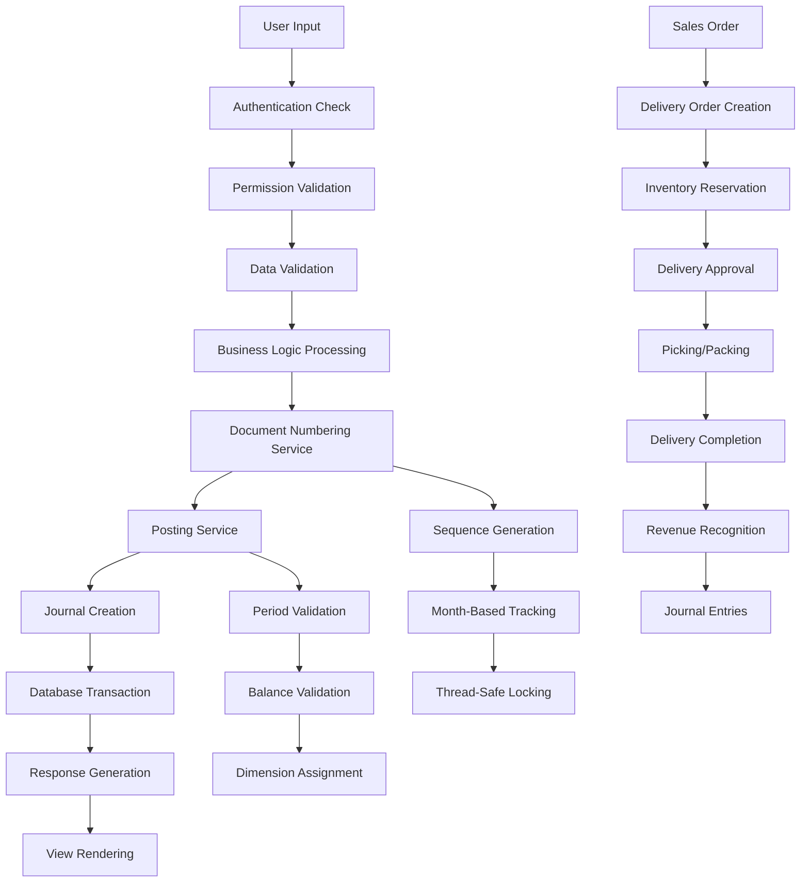
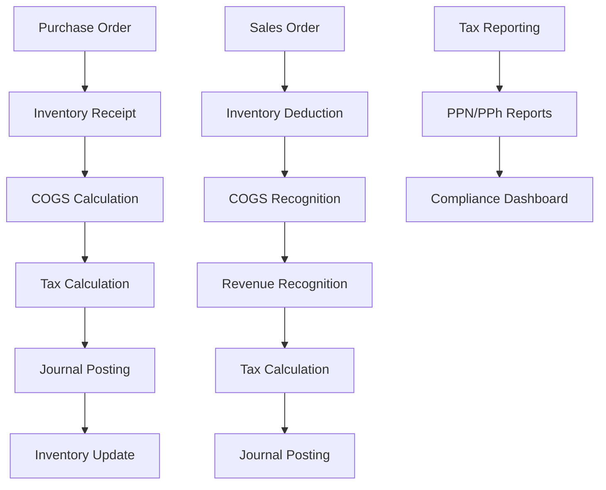

Purpose: Technical reference for understanding system design and development patterns
Last Updated: 2025-01-18 (Updated with Delivery Order System Implementation and Multi-Dimensional Accounting Simplification)

## Architecture Documentation Guidelines

### Document Purpose

This document describes the CURRENT WORKING STATE of the application architecture. It serves as:

-   Technical reference for understanding how the system currently works
-   Onboarding guide for new developers
-   Design pattern documentation for consistent development
-   Schema and data flow documentation reflecting actual implementation

### What TO Include

-   **Current Technology Stack**: Technologies actually in use
-   **Working Components**: Components that are implemented and functional
-   **Actual Database Schema**: Tables, fields, and relationships as they exist
-   **Implemented Data Flows**: How data actually moves through the system
-   **Working API Endpoints**: Routes that are active and functional
-   **Deployment Patterns**: How the system is actually deployed
-   **Security Measures**: Security implementations that are active

### What NOT to Include

-   **Issues or Bugs**: These belong in `MEMORY.md` with technical debt entries
-   **Limitations or Problems**: Document what IS working, not what isn't
-   **Future Plans**: Enhancement ideas belong in `backlog.md`
-   **Deprecated Features**: Remove outdated information rather than marking as deprecated
-   **Wishlist Items**: Planned features that aren't implemented yet

### Update Guidelines

-   **Reflect Reality**: Always document the actual current state, not intended state
-   **Schema Notes**: When database schema has unused fields, note them factually
-   **Cross-Reference**: Link to other docs when appropriate, but don't duplicate content

### For AI Coding Agents

-   **Investigate Before Updating**: Use codebase search to verify current implementation
-   **Move Issues to Memory**: If you discover problems, document them in `MEMORY.md`
-   **Factual Documentation**: Describe what exists, not what should exist

---

# Sarange ERP System Architecture

## Project Overview

Sarange ERP is a comprehensive Enterprise Resource Planning system built with Laravel 12, designed for Indonesian businesses. It provides complete financial management, fixed asset management, procurement, sales, and reporting capabilities with role-based access control and multi-dimensional accounting.

## Technology Stack

-   **Backend**: Laravel 12 (PHP 8.2+)
-   **Frontend**: Blade templates with AdminLTE 3.14, jQuery, DataTables
-   **Database**: MySQL with comprehensive schema (51 migrations)
-   **Authentication**: Laravel Auth with Spatie Permission package
-   **PDF Generation**: DomPDF for document printing
-   **Excel Export**: Laravel Excel (Maatwebsite)
-   **UI Framework**: AdminLTE 3 with Bootstrap 4
-   **Timezone**: Asia/Singapore (configured)

## Navigation Structure

The system uses a hierarchical sidebar navigation structure optimized for trading company operations:

### Main Navigation Sections

1. **Dashboard** - System overview and key metrics
2. **MAIN** - Core business operations:
    - **Sales** - Customer management, sales invoices, orders, receipts
    - **Purchase** - Supplier management, purchase invoices, orders, goods receipts, payments
    - **Inventory** - Item management, stock levels, valuation reports, low stock alerts
    - **Accounting** - Journals, cash expenses, accounts, periods
    - **Master Data** - Projects, funds, departments
    - **Fixed Assets** - Asset categories, assets, depreciation, disposals, movements, import, data quality, bulk operations
3. **REPORTS** - Comprehensive reporting modules
4. **ADMIN** - User management, roles and permissions

### Navigation Features

-   **Role-Based Access**: Menu items are conditionally displayed based on user permissions
-   **Active State Management**: Current page highlighting and menu expansion
-   **Responsive Design**: Collapsible sidebar with mobile-friendly navigation
-   **Icon Integration**: FontAwesome icons for visual navigation cues
-   **Breadcrumb Navigation**: Page-level breadcrumb trails for deep navigation

## Core Components

### 1. Financial Management System

-   **Chart of Accounts**: Hierarchical account structure with 5 types (asset, liability, net_assets, income, expense)
-   **Journal Management**: Manual journal entries with automatic numbering (JNL-YYYYMM-######)
-   **Period Management**: Financial period closing with validation
-   **Posting Service**: Centralized accounting posting with balance validation
-   **Auto-Numbering System**: Centralized document numbering service with consistent PREFIX-YYYYMM-###### format across all document types

### 2. Accounts Receivable (AR) Module

-   **Sales Invoices**: Customer billing with line items, tax codes, and dimensions (SINV-YYYYMM-######)
-   **Sales Receipts**: Payment collection with automatic allocation to invoices (SR-YYYYMM-######)
-   **Sales Orders**: Customer order management with automatic numbering (SO-YYYYMM-######)
-   **AR Aging**: Customer payment tracking and aging analysis
-   **AR Balances**: Customer account balance reporting

### 3. Accounts Payable (AP) Module

-   **Purchase Invoices**: Vendor billing with line items and tax handling (PINV-YYYYMM-######)
-   **Purchase Payments**: Vendor payment processing with allocation (PP-YYYYMM-######)
-   **Purchase Orders**: Vendor order management with automatic numbering (PO-YYYYMM-######)
-   **Goods Receipts**: Inventory receipt processing with automatic numbering (GR-YYYYMM-######)
-   **AP Aging**: Vendor payment tracking and aging analysis
-   **AP Balances**: Vendor account balance reporting

### 4. Dual-Type Inventory System

-   **Item Types**: Support for both physical items and services with item_type field
-   **Order Types**: Purchase and Sales orders support both item and service types
-   **Inventory Impact**: Only 'item' type affects stock quantities, 'service' type bypasses inventory
-   **Document Flow**:
    -   Item PO → GRPO → Sales Invoice (with multi-GRPO combination)
    -   Service PO → Purchase Invoice (direct, no GRPO needed)
-   **Type Validation**: Prevents mixing item/service types within same order
-   **Numbering**: Different prefixes for copied documents (GRPO vs GR)

### 5. Fixed Asset Management

-   **Asset Register**: Complete asset lifecycle management
-   **Asset Categories**: Configurable categories with depreciation settings
-   **Depreciation Management**: Automated depreciation calculation and posting
-   **Asset Disposal**: Disposal process with gain/loss calculation and automatic numbering (DIS-YYYYMM-######)
-   **Asset Movement**: Transfer tracking between departments/projects
-   **Data Quality**: Duplicate detection, completeness checks, consistency validation

### 5. Procurement Management

-   **Purchase Orders**: Vendor order management with approval workflow (PO-YYYYMM-######)
-   **Goods Receipts**: Inventory receipt processing (GR-YYYYMM-######)
-   **Vendor Management**: Vendor master data with performance tracking

### 6. Sales Management

-   **Sales Orders**: Customer order management (SO-YYYYMM-######)
-   **Delivery Orders**: Delivery management with inventory reservation and revenue recognition (DO-YYYYMM-######)
-   **Customer Management**: Customer master data with credit management

### 6.1. Delivery Order System

-   **Delivery Lifecycle Management**: Complete delivery process from sales order to completion
-   **Inventory Reservation**: Automatic stock allocation and reservation upon delivery order approval
-   **Revenue Recognition**: Automated revenue recognition with COGS calculation upon delivery completion
-   **Status Tracking**: Comprehensive status management (draft, picking, packed, ready, in_transit, delivered, completed)
-   **Approval Workflows**: Multi-level approval process with proper authorization controls
-   **Journal Entries Integration**: Automatic journal entries for inventory reservation and revenue recognition
-   **Delivery Tracking**: Logistics cost tracking, performance metrics, and customer satisfaction monitoring
-   **Print Functionality**: Professional delivery order documents with company branding

### 7. Multi-Dimensional Accounting

-   **Projects**: Project-based cost tracking
-   **Departments**: Departmental cost allocation

### 8. Reporting & Analytics

-   **Trial Balance**: Real-time financial position reporting
-   **GL Detail**: Detailed general ledger with filtering
-   **Cash Ledger**: Cash flow tracking and reporting
-   **Asset Reports**: Comprehensive asset reporting suite
-   **AR/AP Reports**: Customer and vendor analysis
-   **Withholding Tax**: Tax reporting and compliance

### 9. Indonesian Tax Compliance System

-   **Tax Transaction Management**: Comprehensive tracking of all tax transactions (PPN, PPh 21-26, PPh 4(2))
-   **Tax Period Management**: Monthly/quarterly/annual tax period management with status tracking
-   **Tax Report Generation**: Automatic SPT (Surat Pemberitahuan Tahunan) report generation
-   **Tax Settings Configuration**: Configurable tax rates, company information, and reporting preferences
-   **Compliance Monitoring**: Overdue tracking, audit trail, and compliance status monitoring
-   **Integration**: Automatic tax calculation with purchase/sales systems

### 10. Advanced Trading Analytics System (Phase 4)

-   **COGS Foundation**: Comprehensive Cost of Goods Sold tracking with multiple valuation methods (FIFO, LIFO, Weighted Average)
-   **Cost Allocation**: Automatic cost allocation across products, customers, and suppliers with configurable methods
-   **Margin Analysis**: Real-time profitability analysis with gross and net margin calculations
-   **Supplier Analytics**: Performance tracking, cost optimization, risk assessment, and supplier ranking
-   **Business Intelligence**: Advanced analytics with insights generation, recommendations engine, and KPI tracking
-   **Unified Dashboard**: Integrated analytics platform combining all trading components for comprehensive decision making

### 11. User Management & Security

-   **Role-Based Access Control**: Granular permission system
-   **User Management**: Complete user lifecycle management
-   **Permission Management**: Fine-grained access control
-   **Session Management**: Secure authentication and session handling

### 12. Training & Documentation System

-   **Comprehensive Training Materials**: Complete 3-day training workshop package with 9 comprehensive documents
-   **Module-Based Training**: 7 specialized training modules covering all major system components
-   **Story-Based Learning**: 35+ realistic business scenarios with hands-on exercises
-   **Assessment Framework**: Multi-level evaluation system with certification levels (Basic, Intermediate, Advanced, Expert)
-   **Indonesian Business Context**: All training materials tailored for Indonesian trading company operations
-   **Implementation Guidelines**: Detailed delivery structure, success metrics, and post-training support

### 13. Master Data Management System

-   **Projects Management**: Project-based cost tracking with comprehensive CRUD operations
-   **Funds Management**: Fund-based accounting and reporting with restricted/unrestricted fund types
-   **Departments Management**: Departmental cost allocation and organizational structure management
-   **SweetAlert2 Integration**: Consistent confirmation dialogs and success notifications across all Master Data features
-   **JSON API Responses**: Proper AJAX handling with JSON success/error responses for seamless user experience
-   **DataTable Integration**: Dynamic data loading with search, sorting, and pagination capabilities

### 14. Comprehensive Auto-Numbering System

-   **Centralized Service**: DocumentNumberingService provides unified document numbering across all document types
-   **Consistent Format**: All documents follow PREFIX-YYYYMM-###### format (e.g., PO-202509-000001)
-   **Thread-Safe Operations**: Database transactions with proper locking prevent duplicate numbers
-   **Month-Based Sequences**: Automatic sequence reset and tracking per month
-   **Document Type Support**: 10 document types with standardized prefixes:
    -   Purchase Orders: PO-YYYYMM-######
    -   Sales Orders: SO-YYYYMM-######
    -   Purchase Invoices: PINV-YYYYMM-######
    -   Sales Invoices: SINV-YYYYMM-######
    -   Purchase Payments: PP-YYYYMM-######
    -   Sales Receipts: SR-YYYYMM-######
    -   Asset Disposals: DIS-YYYYMM-######
    -   Goods Receipts: GR-YYYYMM-######
    -   Cash Expenses: CEV-YYYYMM-######
    -   Journals: JNL-YYYYMM-######
-   **Sequence Management**: DocumentSequence model tracks last sequence per document type and month
-   **Error Handling**: Comprehensive exception handling and validation
-   **Database Persistence**: Sequence tracking stored in document_sequences table with unique constraints

### 15. Unified Design System

-   **Consistent UI Patterns**: All create pages follow unified design standards with card-outline styling
-   **Professional Visual Design**: Enhanced headers with relevant icons, proper color schemes, and visual hierarchy
-   **Responsive Form Layouts**: 3-column responsive layouts with proper Bootstrap grid implementation
-   **Enhanced User Experience**: Select2BS4 integration for improved dropdown functionality with search capabilities
-   **Real-Time Calculations**: Automatic total calculations with Indonesian number formatting across all forms
-   **Professional Table Design**: Card-outline table sections with striped styling and proper action buttons
-   **Improved Navigation**: Consistent breadcrumb navigation and "Back" buttons across all pages
-   **Form Validation**: Comprehensive error handling with proper field indicators and validation messages
-   **Button Styling**: Consistent button design with FontAwesome icons and professional styling
-   **Page Structure**: Standardized page layout with proper sections, headers, and footers
-   **Accessibility**: Proper form labels, required field indicators, and semantic HTML structure

## Database Schema

### Core Tables (52 migrations total - consolidated from 51, plus Phase 3 tax compliance and Phase 4 advanced trading analytics)

#### Financial Tables

-   `accounts`: Chart of accounts with hierarchical structure
-   `journals`: Journal headers with automatic numbering
-   `journal_lines`: Journal line items with dimensions
-   `periods`: Financial periods with close/open status

#### AR/AP Tables

-   `sales_invoices` / `sales_invoice_lines`: Customer billing
-   `sales_receipts` / `sales_receipt_lines`: Customer payments
-   `purchase_invoices` / `purchase_invoice_lines`: Vendor billing
-   `purchase_payments` / `purchase_payment_lines`: Vendor payments
-   `receipt_payment_allocations`: Payment allocation tracking

#### Asset Management Tables

-   `asset_categories`: Asset classification with depreciation rules
-   `assets`: Complete asset register with financial tracking
-   `asset_depreciation_entries`: Depreciation transaction history
-   `asset_depreciation_runs`: Depreciation batch processing
-   `asset_disposals`: Asset disposal transactions
-   `asset_movements`: Asset transfer tracking

#### Master Data Tables

-   `customers`: Customer master data
-   `vendors`: Vendor master data
-   `tax_codes`: Tax configuration
-   `bank_accounts` / `bank_transactions`: Banking integration

#### Order Management Tables

-   `sales_orders` / `sales_order_lines`: Sales order processing with order_type (item/service)
-   `purchase_orders` / `purchase_order_lines`: Purchase order processing with order_type (item/service)
-   `goods_receipts` / `goods_receipt_lines`: Inventory receipt with source tracking (source_po_id, source_type)
-   `sales_invoice_grpo_combinations`: Multi-GRPO Sales Invoice tracking
-   `delivery_orders` / `delivery_order_lines`: Delivery order processing with inventory reservation and revenue recognition
-   `delivery_tracking`: Delivery tracking with logistics cost and performance metrics

#### Dimension Tables

-   `projects`: Project dimension for cost tracking
-   `departments`: Department dimension for cost allocation

#### Trading Company Tables (Phase 1-3)

-   `product_categories`: Hierarchical product categorization
-   `inventory_items`: Product master data with pricing, stock levels, and item_type (item/service)
-   `inventory_transactions`: Stock movement tracking with cost allocation
-   `inventory_valuations`: Real-time inventory valuation with multiple methods
-   `tax_transactions`: Enhanced individual tax calculation tracking with Indonesian compliance
-   `tax_periods`: Tax reporting periods with status management
-   `tax_reports`: SPT report generation and submission tracking
-   `tax_settings`: Configurable tax rates and company information
-   `tax_compliance_logs`: Complete audit trail for tax operations

#### Advanced Trading Analytics Tables (Phase 4)

-   `cost_allocation_methods`: Configurable cost allocation methods (direct, percentage, activity-based)
-   `cost_categories`: Cost categorization for better tracking and analysis
-   `cost_allocations`: Cost allocation rules and configurations
-   `cost_histories`: Historical cost tracking with transaction details
-   `product_cost_summaries`: Aggregated product cost data with period-based summaries
-   `customer_cost_allocations`: Customer-specific cost allocation tracking
-   `margin_analyses`: Comprehensive margin analysis with profitability metrics
-   `supplier_cost_analyses`: Supplier cost analysis and performance tracking
-   `supplier_performances`: Supplier performance metrics and scoring
-   `supplier_comparisons`: Supplier comparison data and benchmarking
-   `business_intelligences`: Business intelligence reports and analytics data

#### Auto-Numbering Tables

-   `document_sequences`: Sequence tracking per document type and month with thread-safe operations
-   `cash_expenses`: Cash expense tracking with automatic numbering (CEV-YYYYMM-######) and creator attribution
-   `asset_disposals`: Asset disposal transactions with automatic numbering (DIS-YYYYMM-######)

#### System Tables

-   `users`: User management with role integration and username field
-   `roles` / `permissions`: RBAC system (Spatie) with consolidated permissions

### Migration Consolidation (2025-01-15)

The database schema has been consolidated from 51 to 44 migration files for improved maintainability:

-   **Table Modifications Merged**: Column additions and foreign key constraints consolidated into original table creation migrations
-   **Foreign Key Dependencies**: Proper ordering established to resolve dependency conflicts
-   **Permissions Consolidated**: All permission additions merged into single migration file
-   **Schema Integrity**: All relationships and constraints preserved and verified through fresh migration testing

## API Design

### Route Structure

-   **Web Routes**: Traditional Laravel web routes with middleware
-   **Permission-Based Access**: All routes protected with granular permissions
-   **RESTful Design**: Standard CRUD operations for all entities
-   **DataTables Integration**: AJAX endpoints for dynamic data loading

### Key Endpoints

-   `/dashboard`: Main dashboard with summary statistics
-   `/accounts/*`: Chart of accounts management
-   `/journals/*`: Journal entry management
-   `/sales-invoices/*`: AR invoice management
-   `/delivery-orders/*`: Delivery order management with inventory reservation and revenue recognition
-   `/purchase-invoices/*`: AP invoice management
-   `/assets/*`: Fixed asset management
-   `/inventory/*`: Inventory management with CRUD operations, stock management, reports
-   `/tax/*`: Indonesian tax compliance management with transactions, periods, reports, settings
-   `/cogs/*`: Cost of Goods Sold management with cost allocation, margin analysis, optimization
-   `/supplier-analytics/*`: Supplier performance analytics with comparisons, optimization opportunities
-   `/business-intelligence/*`: Business intelligence with reports, insights, KPI dashboard
-   `/analytics/*`: Unified analytics dashboard integrating all trading components
-   `/projects/*`: Project management with CRUD operations and SweetAlert2 integration
-   `/funds/*`: Fund management with CRUD operations and SweetAlert2 integration
-   `/departments/*`: Department management with CRUD operations and SweetAlert2 integration
-   `/reports/*`: Comprehensive reporting suite
-   `/admin/*`: User and role management

## Data Flow



## Security Implementation

### Authentication & Authorization

-   **Laravel Auth**: Standard authentication with session management
-   **Spatie Permission**: Role-based access control with granular permissions
-   **Middleware Protection**: All routes protected with appropriate middleware
-   **CSRF Protection**: Built-in CSRF token validation

### Permission System

-   **Granular Permissions**: 50+ specific permissions across all modules including Phase 4 analytics
-   **Role-Based Access**: Predefined roles (admin, manager, user) with custom roles
-   **Module-Level Security**: Each module has view/create/update/delete permissions
-   **Analytics Permissions**: COGS, supplier analytics, business intelligence, and unified analytics access control
-   **Data-Level Security**: Dimension-based data access control

### Data Protection

-   **Input Validation**: Comprehensive validation rules for all inputs
-   **SQL Injection Prevention**: Eloquent ORM with parameterized queries
-   **XSS Protection**: Blade template escaping and input sanitization
-   **Session Security**: Secure session configuration with proper timeouts

### User Interface Enhancements

-   **SweetAlert2 Integration**: Consistent confirmation dialogs and success notifications across all Master Data features
-   **Global Configuration**: Centralized SweetAlert2 configuration with consistent styling and behavior
-   **AJAX Response Handling**: Proper JSON responses for all CRUD operations with comprehensive error handling
-   **DataTable Integration**: Dynamic data loading with search, sorting, and pagination capabilities
-   **Modal Management**: Consistent modal dialogs for create/edit operations with proper form validation

## Deployment

### Development Environment

-   **Laravel Sail**: Docker-based development environment
-   **Vite**: Asset compilation and hot reloading
-   **Queue Workers**: Background job processing
-   **Log Monitoring**: Laravel Pail for real-time log monitoring

### Production Considerations

-   **Database**: MySQL with proper indexing and optimization
-   **Caching**: Laravel cache system for performance
-   **Queue Processing**: Background job processing for PDF generation
-   **File Storage**: Local storage with potential for cloud integration
-   **Backup Strategy**: Database backup and recovery procedures

### Key Dependencies

-   **Laravel Framework**: 12.x with PHP 8.2+ requirement
-   **AdminLTE**: 3.14 for UI framework
-   **Spatie Permission**: 6.15 for RBAC
-   **DomPDF**: 2.0.8 for PDF generation
-   **Laravel Excel**: 1.1 for Excel export/import
-   **DataTables**: 12.x for dynamic table functionality

---

## Trading Company Modification Architecture

### Overview

The system has been analyzed for trading company (perusahaan dagang) operations with comprehensive modification recommendations documented in `docs/TRADING-COMPANY-MODIFICATION-PLAN.md`. This section outlines the architectural changes required for PSAK compliance and Indonesian tax regulations.

### Required Database Schema Extensions

#### New Tables for Trading Operations

```sql
-- Inventory Management
inventory_items: Product master data with trading-specific fields
inventory_transactions: Stock movement tracking with cost allocation
inventory_valuations: Cost tracking with multiple valuation methods

-- Tax Compliance
tax_codes: PPN/PPh rate configuration
tax_transactions: Tax calculation tracking
tax_reports: Compliance reporting data

-- Trading Operations
supplier_performance: Vendor evaluation metrics
customer_credit_limits: Credit management
sales_commissions: Commission tracking
margin_analysis: Profitability tracking
```

#### Modified Chart of Accounts Structure

The current CoA requires complete restructuring for PSAK compliance:

-   **7 Main Categories**: Assets, Liabilities, Equity, Revenue, COGS, Operating Expenses, Other Income/Expenses
-   **Trading-Specific Accounts**: Inventory, COGS, Sales Returns, Purchase Discounts
-   **Tax Accounts**: PPN Masukan/Keluaran, PPh 21/22/23/25
-   **Indonesian Compliance**: Rupiah formatting, PSAK-standard reporting

### Required Controller Extensions

#### New Controllers

-   `InventoryController`: Stock management and valuation
-   `COGSController`: Cost of goods sold calculation
-   `PPNController`: VAT management and reporting
-   `PPhController`: Income tax automation
-   `MarginAnalysisController`: Profitability analysis
-   `TradingReportsController`: Trading-specific reporting

#### Enhanced Existing Controllers

-   `PurchaseOrderController`: Supplier comparison, freight tracking
-   `SalesOrderController`: Credit limits, commission tracking
-   `ReportsController`: PSAK-compliant financial statements

### Required Service Layer Additions

#### New Services

-   `InventoryService`: Stock valuation methods (FIFO, LIFO, Weighted Average)
-   `COGSService`: Automatic cost calculation and allocation
-   `TaxCalculationService`: PPN/PPh automation
-   `MarginAnalysisService`: Profitability calculations
-   `TradingReportService`: Compliance reporting

### Data Flow Modifications



### Security Considerations

#### New Permissions Required

-   `inventory.view/create/update/delete`: Inventory management
-   `cogs.view/calculate`: Cost of goods sold access
-   `tax.ppn.view/calculate/report`: VAT management
-   `tax.pph.view/calculate/report`: Income tax management
-   `margin.view/analyze`: Profitability analysis
-   `trading.reports.view`: Trading-specific reporting

#### Data Security

-   Inventory cost data protection
-   Tax calculation accuracy validation
-   Customer credit information security
-   Supplier performance data confidentiality

### Integration Points

#### External Systems

-   **E-Faktur**: Electronic invoice system integration
-   **Tax Authority APIs**: Automated tax reporting
-   **Banking Systems**: Payment processing integration
-   **Supplier Portals**: Automated purchase order processing

#### Internal Integrations

-   **Multi-dimensional Accounting**: Project/fund/department tracking
-   **Fixed Asset Management**: Equipment and depreciation
-   **User Management**: Role-based access control
-   **Reporting System**: Unified financial reporting

### Performance Considerations

#### Database Optimization

-   Inventory transaction indexing for real-time queries
-   Tax calculation caching for performance
-   Report generation optimization
-   Large dataset handling for inventory valuation

#### System Scalability

-   Inventory transaction volume handling
-   Concurrent user access for stock updates
-   Report generation under load
-   Tax calculation performance optimization

### Compliance Architecture

#### PSAK Compliance

-   Indonesian financial statement formats
-   Revenue recognition standards
-   Inventory valuation methods
-   Asset and liability classification

#### Tax Compliance

-   PPN (VAT) 11% calculation and reporting
-   PPh automation (21, 22, 23, 25)
-   Monthly tax reporting (SPT Masa)
-   Annual tax return preparation (SPT Tahunan)

### Deployment Considerations

#### Development Environment

-   Inventory data migration scripts
-   Tax configuration setup
-   PSAK-compliant reporting templates
-   User training materials

#### Production Deployment

-   Data migration from current system
-   Tax configuration validation
-   Compliance testing procedures
-   User acceptance testing protocols
