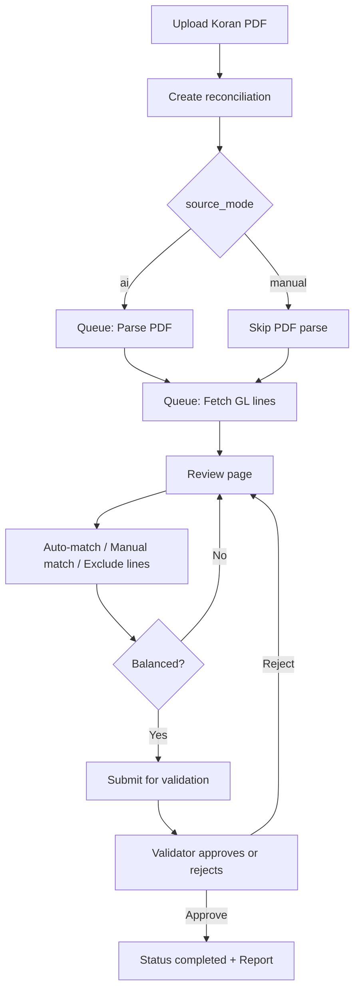

# Bank Reconciliation Module — Implementation Guide

Portable reference for re-implementing the **Bank Reconciliation** feature from this project into another Laravel application. The module matches **bank statement lines** (from Rekening Koran PDF or manual entry) against **book/GL line snapshots** per bank account and month, with N:M match groups, outstanding carry-forward, statement cross-foot, in-module adjusting journals, and finalize on the standard reconciliation identity.

> **Current behaviour (2026-07-20):** Finalize requires (1) no `unmatched` lines, (2) cleared `bank_net + book_net ≈ 0`, (3) statement cross-foot when balances are set, (4) `statement_closing + deposits_in_transit − outstanding_checks ≈ book_closing`. Outstanding book/bank lines carry into the next month's session. See `docs/decisions.md` (2026-07-20) and `MEMORY.md` [131].

---

## 1. Purpose & Scope

| Side | Source in this app | Stored in |
|------|-------------------|-----------|
| **Bank** | PDF Rekening Koran (AI parse) or manual lines | `bank_statement_lines` |
| **Book** | SAP GL / account statement API | `sap_gl_lines` |

**One reconciliation session** = one bank account (`giro`) + one calendar month (`periode`). Unique constraint: `(giro_id, periode)`.

**Out of scope for a minimal port:** Koran dashboard grid UI, HELP/RAG manuals, dashboard validator card — optional integrations documented in §12.

---

## 2. User Workflow (End-to-End)



**Roles:**

- **Preparer** — creates session, matches lines, submits.
- **Validator** — user with `validate_bank_reconciliation` who did **not** create/submit the session (segregation of duties).

---

## 3. Critical Accounting Rule — Sign Convention

This is the most important rule when porting. Bank statements and book ledgers use **opposite debit/credit polarity** for the same cash movement.

| Concept | Formula |
|---------|---------|
| Bank net per line | `debit - credit` |
| Book (SAP) net per line | `debit - credit` |
| **Match group valid** | `bank_total + sap_total ≈ 0` (tolerance `0.005`) |
| **Session balanced** | `SUM(bank nets) + SUM(book nets) ≈ 0` (excluding `excluded` lines) |

**Example — same transaction:**

- Bank line: debit `48,010,000`, credit `0` → net `+48,010,000`
- SAP line: debit `0`, credit `48,010,000` → net `-48,010,000`
- Sum = `0` → **balanced** ✓

**Wrong approach (do not use):** `bank_net - sap_net` or matching same-side debit/debit.

Auto-match cross-compares amounts: `bank.debit ≈ sap.credit` AND `bank.credit ≈ sap.debit`.

---

## 4. Status & State Machine

### 4.1 `bank_reconciliations.status`

| Value | Meaning |
|-------|---------|
| `draft` | Created, not started (legacy default) |
| `processing` | PDF parse / data fetch in progress |
| `in_review` | Lines loaded; user can match |
| `completed` | Validator approved |
| `failed` | PDF parse failed (`notes` has error) |

### 4.2 `bank_reconciliations.validation_status`

| Value | Meaning |
|-------|---------|
| `null` | Not submitted |
| `pending_validation` | Submitted; editing locked |
| `validated` | Approved |
| `rejected` | Returned to preparer (`rejection_reason` set) |

### 4.3 `source_mode`

| Value | Behavior |
|-------|----------|
| `ai` | Requires `dokumen_id` (Koran PDF); dispatches `ParseBankStatementJob`; starts as `processing` |
| `manual` | No PDF; user adds bank lines manually; starts as `in_review` |

### 4.4 Line `matched_status` (bank + book)

| Value | Meaning |
|-------|---------|
| `unmatched` | Available for matching |
| `matched` | Auto-matched |
| `manual` | Manually grouped |
| `excluded` | Removed from balance totals (`exclude_reason` required) |

### 4.5 Editing lock

`isLockedForEditing()` = `true` when:

- `status === completed`, OR
- `validation_status === pending_validation`

---

## 5. Database Schema

Run migrations in order (or merge into your project). Tables below reflect the **current** schema after all reconciliation migrations.

### 5.1 `bank_reconciliations`

```sql
id
giro_id              -- FK → bank accounts (giros)
dokumen_id           -- FK → uploaded Koran PDF (nullable)
periode              -- date, first day of month (e.g. 2026-05-01)
status               -- varchar(32)
source_mode          -- 'ai' | 'manual'
validation_status    -- nullable varchar(32)
opening_balance_bank / closing_balance_bank  -- decimal(18,2) nullable
opening_balance_book / closing_balance_book  -- decimal(18,2) nullable
reconciled_by, reconciled_at
submitted_by, submitted_at
validated_by, validated_at
rejection_reason     -- text nullable
notes                -- text nullable
created_by           -- FK users
timestamps

UNIQUE (giro_id, periode)
```

### 5.2 `bank_statement_lines`

```sql
id
bank_reconciliation_id  -- FK, cascade delete
transaction_date, value_date  -- date nullable
description               -- text
reference                 -- varchar(191)
debit, credit             -- decimal(18,2), default 0
balance                   -- decimal(18,2) nullable
is_ai_extracted           -- boolean
ai_confidence             -- float nullable
matched_status            -- varchar(32)
exclude_reason, line_notes -- varchar(500) nullable
line_order                -- unsigned int nullable
timestamps

INDEX (bank_reconciliation_id, matched_status)
```

### 5.3 `sap_gl_lines`

```sql
id
bank_reconciliation_id  -- FK, cascade delete
doc_date, posting_date  -- date nullable
doc_num, ref_doc_num, transaction_id  -- varchar
description             -- text
project_code            -- varchar(64)
debit, credit           -- decimal(18,2)
matched_status
exclude_reason, line_notes
timestamps

INDEX (bank_reconciliation_id, matched_status)
```

### 5.4 Match groups (N:M matching)

Legacy `reconciliation_matches` (1:1) was replaced by:

**`reconciliation_match_groups`**

```sql
id
bank_reconciliation_id
match_type       -- auto_exact | auto_fuzzy | auto_split | manual
confidence_score -- float nullable
bank_total, sap_total, difference  -- decimal(18,2)
notes
created_by
timestamps
```

**`match_group_bank_lines`** — pivot; `UNIQUE(bank_statement_line_id)` (one line → one group max)

**`match_group_sap_lines`** — pivot; `UNIQUE(sap_gl_line_id)`

### 5.5 Migration files (source project)

| File | Purpose |
|------|---------|
| `2026_05_08_064437_create_bank_reconciliations_table.php` | Main session table |
| `2026_05_08_064438_create_bank_statement_lines_table.php` | Bank lines |
| `2026_05_08_064438_create_sap_gl_lines_table.php` | Book lines |
| `2026_05_08_064439_create_reconciliation_matches_table.php` | Legacy 1:1 (superseded) |
| `2026_05_08_082902_migrate_to_reconciliation_match_groups_for_nm_matching.php` | N:M groups + data migration |
| `2026_07_01_063341_add_manual_and_validation_fields_to_bank_reconciliations_table.php` | Validation workflow |
| `2026_07_01_063341_add_exclude_fields_to_reconciliation_lines_tables.php` | Exclude + line notes |
| `2026_07_02_035611_recompute_reconciliation_match_group_difference_sign.php` | Fix `difference` sign |

---

## 6. Application Layer — File Inventory

Copy and adapt these paths from the source repo:

### 6.1 Models

| File | Notes |
|------|-------|
| `app/Models/BankReconciliation.php` | Status constants, scopes, `isLockedForEditing()`, `isPreparer()` |
| `app/Models/BankStatementLine.php` | `MATCH_*` constants |
| `app/Models/SapGlLine.php` | Same match constants |
| `app/Models/ReconciliationMatchGroup.php` | `TYPE_*` constants |
| `app/Models/MatchGroupBankLine.php` | Pivot |
| `app/Models/MatchGroupSapLine.php` | Pivot |

### 6.2 Services (core business logic)

| File | Responsibility |
|------|----------------|
| `app/Services/ReconciliationBalanceService.php` | `bankNet()`, `bookNet()`, `difference()`, `isBalanced()`, tolerance `0.005` |
| `app/Services/ReconciliationMatchingService.php` | Auto-match (exact, fuzzy, split), manual groups, unmatch |
| `app/Services/BankStatementParserService.php` | PDF → lines via OpenRouter |
| `app/Services/OpenRouterService.php` | `extractBankStatementFromPdfBase64()`, `chat()` for fuzzy AI confirm |

### 6.3 Jobs (queue)

| Job | Trigger | Notes |
|-----|---------|-------|
| `ParseBankStatementJob` | Create (ai mode), Re-parse | Sets `failed` on error; `in_review` on success |
| `FetchSapGlLinesJob` | Create, Re-fetch | Replace book lines for period |
| `AutoMatchReconciliationJob` | Auto-match button | Clears prior auto groups first |

All jobs use `$this->afterCommit()` in constructor to avoid dispatch before DB commit.

### 6.4 HTTP layer

| File | Purpose |
|------|---------|
| `app/Http/Controllers/Cashier/BankReconciliationController.php` | Full CRUD + match + validation |
| `app/Http/Requests/StoreBankReconciliationRequest.php` | Create validation, duplicate period check |
| `app/Http/Requests/ManualMatchGroupBankReconciliationRequest.php` | Multi-select match validation |
| `app/Http/Requests/RejectBankReconciliationRequest.php` | Rejection reason |
| `app/Http/Requests/StoreBankStatementLineRequest.php` | Manual line CRUD |

### 6.5 Views (Blade)

| Path | Screen |
|------|--------|
| `resources/views/cashier/bank-reconciliation/index.blade.php` | List + pending validation tab |
| `resources/views/cashier/bank-reconciliation/create.blade.php` | New session |
| `resources/views/cashier/bank-reconciliation/show.blade.php` | Review, match UI, sticky balance bar |
| `resources/views/cashier/bank-reconciliation/report.blade.php` | Print report after validation |
| `resources/views/cashier/bank-reconciliation/partials/bank-line-fields.blade.php` | Manual line form partial |

### 6.6 Routes

Registered under `routes/cashier.php` prefix `cashier/bank-reconciliation`:

| Method | URI suffix | Action |
|--------|------------|--------|
| GET | `/` | index |
| GET | `/create` | create |
| POST | `/` | store |
| GET | `/{id}` | show |
| GET | `/{id}/status` | JSON poll (counts, balance) |
| POST | `/{id}/parse` | re-parse PDF |
| POST | `/{id}/fetch-sap` | re-fetch GL |
| POST | `/{id}/auto-match` | queue auto-match |
| POST | `/{id}/match` | manual N:M match |
| POST | `/{id}/unmatch/{group}` | remove group |
| POST | `/{id}/lines` | add bank line |
| PUT | `/{id}/lines/{line}` | update bank line |
| DELETE | `/{id}/lines/{line}` | delete bank line |
| POST | `/{id}/lines/{line}/exclude` | exclude/include bank line |
| POST | `/{id}/sap-lines/{line}/exclude` | exclude/include SAP line |
| POST | `/{id}/submit` | submit for validation |
| POST | `/{id}/validate` | validator approve |
| POST | `/{id}/reject` | validator reject |
| GET | `/{id}/report` | printable report |

Route names: `cashier.bank-reconciliation.*`

### 6.7 Tests (reference behavior)

| Test file | Covers |
|-----------|--------|
| `tests/Feature/BankReconciliationSignConventionTest.php` | Opposite polarity matching & balance |
| `tests/Feature/BankReconciliationManualValidationTest.php` | Submit/validate/reject workflow |
| `tests/Feature/BankReconciliationValidatorDashboardTest.php` | Pending validation list |
| `tests/Unit/OpenRouterBankStatementTest.php` | PDF extraction payload shape |

---

## 7. Matching Engine Details

### 7.1 Auto-match order

1. **Clear** existing auto groups (`auto_exact`, `auto_fuzzy`, `auto_split`) — manual groups preserved.
2. **Exact** — opposite amounts, dates within **1 day**.
3. **Fuzzy** — opposite amounts, dates within **5 days**:
   - `similar_text` on descriptions ≥ 40%, OR
   - OpenRouter AI confirmation (confidence > 0.6).
4. **Split many SAP → one bank** — subset of up to **5** SAP lines within **7** days, net sums to negate bank line.
5. **Split many bank → one SAP** — same logic reversed.

### 7.2 Manual match

- User selects ≥1 bank line(s) and ≥1 SAP line(s).
- Server validates all `unmatched`, same reconciliation, and `bank_total + sap_total ≈ 0`.
- Creates group with `match_type = manual`; lines get `matched_status = manual`.

### 7.3 Unmatch

- Deletes group; resets all linked lines to `unmatched`.
- Blocked when session is locked.

---

## 8. Balance Service

```php
// ReconciliationBalanceService — port exactly
bankNet  = SUM(debit - credit) WHERE matched_status != 'excluded'  // bank_statement_lines
bookNet  = SUM(debit - credit) WHERE matched_status != 'excluded'  // sap_gl_lines
difference = bankNet + bookNet
isBalanced = abs(difference) < 0.005
```

Submit for validation requires `isBalanced() === true`.

---

## 9. External Integrations

### 9.1 OpenRouter (PDF parsing)

**Environment variables:**

```env
OPENROUTER_API_KEY=
OPENROUTER_BASE_URL=https://openrouter.ai/api/v1
OPENROUTER_MODEL=google/gemini-2.0-flash-001
OPENROUTER_BANK_STATEMENT_MODEL=google/gemini-3-flash-preview
OPENROUTER_TIMEOUT=120
```

Use a **vision-capable model** for PDF (`OPENROUTER_BANK_STATEMENT_MODEL`). GPT-4o vision does **not** accept `data:application/pdf` MIME.

**Expected JSON from AI:**

```json
{
  "opening_balance": 1000000,
  "closing_balance": 1500000,
  "lines": [
    {
      "transaction_date": "2026-05-04",
      "value_date": "2026-05-04",
      "description": "TRF IN",
      "reference": "REF123",
      "debit": 500000,
      "credit": 0,
      "balance": 1500000,
      "confidence": 0.95
    }
  ]
}
```

PDF files are stored under `public/dokumens/` (filename on `dokumens.filename1`).

### 9.2 SAP / GL fetch (`FetchSapGlLinesJob`)

Resolution order:

1. `giro.sap_account` → SAP Service Layer `getGLLines(account, start, end)`
2. Fallback: project `Account` where `type = bank`
3. Fallback: SAP Bridge `AccountStatementService::getAccountStatement()`

**Adapt for your ERP:** Replace `SapService` / `AccountStatementService` with your GL API. Keep the same `sap_gl_lines` column mapping:

| API field | DB column |
|-----------|-----------|
| posting date | `posting_date`, `doc_date` |
| document number | `doc_num` |
| reference / tx num | `ref_doc_num`, `transaction_id` |
| description | `description` |
| debit / credit amounts | `debit`, `credit` |

Period = full calendar month of `bank_reconciliations.periode`.

### 9.3 Queue

```env
QUEUE_CONNECTION=database   # or redis — not sync for production
```

Run `php artisan queue:work` so PDF parse, SAP fetch, and auto-match do not block HTTP requests.

---

## 10. Permissions (Spatie)

| Permission | Purpose |
|------------|---------|
| `akses_koran` | Access Bank Reconciliation + Rekening Koran menus |
| `upload_koran` | Upload Koran PDF from dashboard |
| `delete_koran` | Delete Koran (blocked if reconciliation locked) |
| `validate_bank_reconciliation` | Approve/reject submitted sessions |

Seeder: `database/seeders/ValidateBankReconciliationPermissionSeeder.php` (assigns validate to admin/superadmin).

**Access scoping:** Elevated roles see all projects; others filter by `user.project` = `giro.project`.

**Validator rule:** Cannot validate if `isPreparer(auth()->id())` — creator, submitter, or reconciler.

---

## 11. Prerequisites in Target Project

Minimum entities to have before enabling the module:

| Entity | Required fields / notes |
|--------|-------------------------|
| **Giro** (bank account) | `acc_no`, `bank_id`, `project`, optional `sap_account` |
| **Dokumen** | `type = 'koran'`, `giro_id`, `periode`, `filename1` (PDF path) |
| **User** | `project` for scoping; Spatie roles/permissions |
| **Bank** | Parent of Giro (display only) |

Optional: Koran dashboard (`KoranController`) for matrix upload UX — not required if users only use Bank Reconciliation → Create.

---

## 12. Optional Integrations (Source Project Only)

| Feature | Location |
|---------|----------|
| Koran month grid + cell modal | `KoranController`, `koran/dashboard.blade.php`, `cell-reconciliation-block.blade.php` |
| Dashboard validator card | `DashboardUserController`, `dashboard/row2.blade.php` |
| Menu search entry | `MenuSearchService` |
| User manual / HELP | `docs/manuals/bank-reconciliation-manual-en.md` |

---

## 13. Step-by-Step Port Checklist

### Phase A — Database & models

- [ ] Create/adapt migrations (§5); run `php artisan migrate`
- [ ] Port 6 Eloquent models with constants and relationships
- [ ] Ensure `giros`, `dokumens`, `users` exist with expected columns

### Phase B — Services

- [ ] Port `ReconciliationBalanceService` (verify sign convention with unit tests)
- [ ] Port `ReconciliationMatchingService`
- [ ] Port or stub `OpenRouterService` + `BankStatementParserService`
- [ ] Implement `FetchSapGlLinesJob` adapter for your ERP

### Phase C — Async jobs

- [ ] Port 3 jobs; configure `QUEUE_CONNECTION`
- [ ] Test: create reconciliation → lines appear after worker runs

### Phase D — HTTP & validation

- [ ] Port controller + form requests
- [ ] Register routes (§6.6)
- [ ] Wire authorization (project scope + permissions)

### Phase E — UI

- [ ] Port Blade views or rebuild in your frontend stack
- [ ] Review page: dual grids, checkboxes, match groups table, sticky `bank_net` / `book_net` / `difference`
- [ ] Poll `GET .../status` while jobs run (JSON in §6.6)

### Phase F — Workflow

- [ ] Submit → locks editing (`pending_validation`)
- [ ] Validator approve → `completed` + redirect to report
- [ ] Validator reject → clears submitter, sets `rejection_reason`

### Phase G — Permissions & seeders

- [ ] Create Spatie permissions (§10)
- [ ] Assign roles appropriately

### Phase H — Tests

- [ ] Port `BankReconciliationSignConventionTest` first — catches polarity bugs early
- [ ] Add validation workflow tests
- [ ] Run `php artisan test --filter=BankReconciliation`

---

## 14. JSON Status Endpoint (for SPA / polling)

`GET /cashier/bank-reconciliation/{id}/status` returns:

```json
{
  "status": "in_review",
  "validation_status": null,
  "bank_lines_count": 42,
  "sap_lines_count": 38,
  "match_groups_count": 35,
  "matches_count": 35,
  "bank_net": 1250000.00,
  "book_net": -1250000.00,
  "difference": 0.00,
  "is_balanced": true
}
```

---

## 15. Common Pitfalls

| Issue | Cause | Fix |
|-------|-------|-----|
| Match button disabled despite equal amounts | Same-side debit/debit | Use `bank_net + sap_net ≈ 0` |
| PDF parse fails instantly | `QUEUE_CONNECTION=sync` + timeout | Use database/redis queue + worker |
| Provider error on PDF | Wrong OpenRouter model | Use `OPENROUTER_BANK_STATEMENT_MODEL` (Gemini flash) |
| Duplicate reconciliation | Same giro + month | Enforced in `StoreBankReconciliationRequest` |
| Validator cannot approve | Same user prepared session | `excludingPreparer` scope + `isPreparer()` check |
| Cannot delete Koran | Reconciliation locked | Check `isLockedForEditing()` on linked session |

---

## 16. Related Documentation in Source Repo

| Doc | Content |
|-----|---------|
| `docs/manuals/bank-reconciliation-manual-en.md` | End-user how-to |
| `docs/manuals/bank-reconciliation-manual-id.md` | Indonesian user manual |
| `MEMORY.md` entries [042]–[053] | Implementation history & decisions |
| `docs/architecture.md` | System context (if present) |
| `docs/decisions.md` | ADR-BANK-REC-01 (N:M match groups) |

---

## 17. Minimal Viable Port (Without AI / SAP)

If the target project has no OpenRouter or SAP yet:

1. Use **`source_mode = manual`** only.
2. Let users CSV-import or key in `bank_statement_lines`.
3. Replace `FetchSapGlLinesJob` with import from your GL export (same `sap_gl_lines` schema).
4. Keep matching + balance + validation workflow unchanged.

The matching engine and balance rules are **ERP-agnostic**; only parsers/fetchers are integration-specific.

---

*Generated from `accounting-one-sidebar` codebase — Laravel 10, PHP 8.2. Last aligned with migrations through 2026-07-02.*
