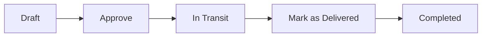

# Manual Modul Delivery Order (Surat Jalan)

## Daftar Isi

1. [Peningkatan Utama (Major Improvements)](#peningkatan-utama-major-improvements)
2. [Pengenalan](#pengenalan)
3. [Memulai](#memulai)
4. [Alur Kerja Delivery Order](#alur-kerja-delivery-order)
5. [Membuat Delivery Order](#membuat-delivery-order)
6. [Halaman Daftar Delivery Order](#halaman-daftar-delivery-order)
7. [Halaman Detail Delivery Order](#halaman-detail-delivery-order)
8. [Membatalkan Delivery Order (Cancel DO)](#membatalkan-delivery-order-cancel-do)
9. [Tabel Delivery Items](#tabel-delivery-items)
10. [Persetujuan dan Penolakan](#persetujuan-dan-penolakan)
11. [Mark as Delivered (Tandai Terkirim)](#mark-as-delivered-tandai-terkirim)
12. [Membuat Faktur dari Delivery Order](#membuat-faktur-dari-delivery-order)
13. [Fitur Tambahan](#fitur-tambahan)
14. [Pemecahan Masalah](#pemecahan-masalah)
15. [Referensi Cepat](#referensi-cepat)

---

## Peningkatan Utama (Major Improvements)

Modul Delivery Order telah disederhanakan dengan peningkatan berikut:

### 1. Alur Kerja yang Disederhanakan

| Sebelum | Sesudah |
|--------|---------|
| Draft → Approve → **Picking** (isi Picked Qty per baris) → Packed → Ready → In Transit → isi Delivered Qty per baris → **Complete Delivery** (jurnal pendapatan) | Draft → Approve → **In Transit** (langsung) → **Mark as Delivered** (satu tombol) |

- **Stok berkurang saat Approve** (bukan saat Picking). Barang dianggap "dalam perjalanan" setelah disetujui.
- **Langkah Picking dihapus** — tidak perlu mengisi Picked Qty per baris.
- **Langkah Complete Delivery digabung** — jurnal pengakuan pendapatan dibuat otomatis saat Mark as Delivered.

### 2. Tabel Delivery Items yang Lebih Jelas

| Kolom | Keterangan |
|-------|------------|
| **No** | Nomor urut baris |
| **Item Code** | Kode item |
| **Item Name** | Nama item |
| **Ordered Qty** | Jumlah pesanan asli dari SO |
| **Remain Qty** | Sisa qty SO yang belum terkirim oleh DO lain (referensi, read-only) |
| **Delivery Qty** | Jumlah yang akan dikirim dengan DO ini (dapat diedit saat Draft) |
| **Action** | Edit/Delete baris (hanya saat Draft) |

### 3. Mark as Delivered — Satu Tombol untuk Selesaikan Pengiriman

- Tombol **"Mark as Delivered"** muncul saat DO status **In Transit** atau **Ready**.
- Klik tombol → modal muncul → isi **Tanggal & Waktu Terkirim** dan **Delivered By** (nama yang menyerahkan).
- Sistem otomatis: menandai semua baris terkirim, menyinkronkan SO, **membuat jurnal pengakuan pendapatan**, dan mengubah status ke **Completed**.

### 4. Penyederhanaan Tampilan

- **VAT, WTax, Unit Price** tidak ditampilkan di form create, edit, show, dan print DO (tetap disimpan di database untuk keperluan faktur).
- **Delivered At** dan **Delivered By** ditampilkan di halaman detail setelah DO ditandai terkirim.

### 5. Jurnal yang Dihasilkan

| Langkah | Jurnal |
|---------|--------|
| **Approve** | Jurnal reservasi inventory (DR Inventory Reserved, CR Inventory Available) + pengurangan stok fisik |
| **Mark as Delivered** | Jurnal pengakuan pendapatan (Revenue, COGS, AR UnInvoice, release Inventory Reserved) |

---

## Pengenalan

### Apa itu Delivery Order?

**Delivery Order (DO)** atau **Surat Jalan** adalah dokumen yang menginstruksikan pengiriman barang dari gudang ke pelanggan berdasarkan Sales Order (SO). Modul ini mendukung proses fisik pengambilan barang di gudang hingga penyerahan ke pelanggan.

### Manfaat Modul Delivery Order

- **Pelacakan pengiriman**: Status dari draft hingga barang terkirim dan pendapatan terakui
- **Integrasi dengan Sales Order**: DO dibuat dari SO yang sudah disetujui dan dikonfirmasi
- **Alur sederhana**: Approve → In Transit → Mark as Delivered (tanpa langkah Picking manual)
- **Relationship Map**: Melihat hubungan dokumen (SO → DO → Faktur)
- **Pembuatan Faktur**: Membuat Sales Invoice langsung dari DO yang sudah terkirim

### Siapa yang Menggunakan?

- **Tim Penjualan**: Membuat DO dari SO, memantau status pengiriman
- **Gudang/Logistik**: Menyetujui DO, menandai barang terkirim saat sampai di pelanggan
- **Akuntansi**: Pengakuan pendapatan otomatis saat Mark as Delivered, pembuatan faktur

---

## Memulai

### Mengakses Modul Delivery Order

1. Masuk ke sistem ERP
2. Dari menu sidebar, pilih **"Delivery Orders"** di bawah menu Sales/Orders
3. Anda akan melihat halaman daftar Delivery Order

### Rute Alternatif

- Dari **Sales Order** yang sudah disetujui dan dikonfirmasi: klik tombol **"Create Delivery Order"**
- Dari **Dashboard**: tautan cepat ke Delivery Orders (jika tersedia)

---

## Alur Kerja Delivery Order

### Status Delivery Order

| Status | Keterangan |
|--------|------------|
| **Draft** | DO baru dibuat, belum diajukan. Masih dapat diedit (termasuk Delivery Qty). |
| **In Transit** | Sudah disetujui. Stok berkurang, barang dianggap dalam perjalanan. |
| **Ready** | (Opsional) Semua baris siap dikirim. |
| **Delivered** | Semua barang sudah diserahkan (status sementara sebelum Completed). |
| **Completed** | Pengiriman selesai, jurnal pendapatan terakui, DO final. |
| **Cancelled** | DO dibatalkan. |

**Catatan**: Status `Picking`, `Packed`, `Partial Delivered` tidak lagi digunakan dalam alur baru. Setelah Approve, DO langsung ke **In Transit**.

### Status Approval

| Approval | Keterangan |
|----------|------------|
| **Pending** | Menunggu persetujuan. |
| **Approved** | Sudah disetujui. |
| **Rejected** | Ditolak. |

---

## Membuat Delivery Order

### Beberapa DO Sebagian per Sales Order

Satu Sales Order dapat memiliki **banyak Delivery Order**. Ini berguna untuk pengiriman bertahap (split delivery), beda tanggal, atau beda gudang. Sistem otomatis:

- Menampilkan kolom **Ordered Qty** (qty asli SO) dan **Remain Qty** (sisa qty SO minus yang sudah terkirim oleh DO lain)
- Hanya menampilkan baris SO yang **belum sepenuhnya terkirim**
- **Delivery Qty** dapat diedit (maksimal = Remain Qty)

Tombol **Create Delivery Order** tersedia saat status SO = **Confirmed** atau **Processing**.

### Dari Sales Order (Disarankan)

1. Buka halaman detail **Sales Order** yang sudah **disetujui** dan **dikonfirmasi** (atau status **Processing**)
2. Pastikan tipe order adalah **item** (bukan service)
3. Klik tombol **"Create Delivery Order"**
4. Form akan terisi otomatis dari data SO (pelanggan, alamat, barang)
5. Klik **"Copy Lines"** untuk memuat baris SO yang tersisa
6. Sesuaikan **Delivery Qty** per baris jika perlu (maksimal = Remain Qty)
7. Sesuaikan: tanggal rencana pengiriman, alamat pengiriman, metode pengiriman
8. Klik **"Create Delivery Order"**

### Dari Halaman Delivery Order (Manual)

1. Buka **Delivery Orders** → klik **"Create Delivery Order"**
2. Pilih **Sales Order** dari dropdown
3. Pilih **Customer** (terisi otomatis jika SO dipilih)
4. Pilih **Warehouse**, **Planned Delivery Date**, **Delivery Method**
5. Isi **Delivery Address**, **Contact Person**, **Phone**
6. Klik **"Copy Lines"** untuk memuat baris dari SO
7. Sesuaikan **Delivery Qty** per baris (lihat kolom Remain Qty sebagai referensi)
8. Klik **"Create Delivery Order"**

### Metode Pengiriman

- **Own Fleet**: Kendaraan sendiri
- **Courier**: Ekspedisi/kurir
- **Customer Pickup**: Pelanggan ambil di lokasi

---

## Halaman Daftar Delivery Order

### Filter

- **Status**: Draft, In Transit, Delivered, Completed, Cancelled
- **Customer**: Filter berdasarkan pelanggan
- **Date From / Date To**: Filter berdasarkan tanggal rencana pengiriman
- Klik **"Filter"** untuk menerapkan

### Kolom Tabel

| Kolom | Keterangan |
|-------|------------|
| DO Number | Nomor surat jalan |
| Sales Order | Nomor SO terkait |
| Customer | Nama pelanggan |
| Planned Delivery | Tanggal rencana pengiriman (format dd-mmm-yyyy) |
| Status | Status DO |
| Approval | Status persetujuan |
| Created By | Pembuat DO |
| Actions | Tombol View |

---

## Halaman Detail Delivery Order

### Informasi Header

- **DO Number**, **Sales Order**, **Reference No** (jika ada)
- **Customer**, **Planned Delivery Date**, **Delivery Method**
- **Delivery Address** beserta kontak dan telepon
- **Delivered At** dan **Delivered By** (tampil setelah Mark as Delivered)
- **Status** dan **Approval** (badge)

### Tombol di Header

- **Relationship Map**: Menampilkan peta hubungan dokumen (SO, DO, Faktur)
- **Print**: Mencetak surat jalan (pilih Standard atau Dot Matrix)
- **Edit**: Hanya tampil saat status **Draft**
- **Cancel delivery order**: Tampil jika DO **boleh dibatalkan** (lihat [Membatalkan Delivery Order](#membatalkan-delivery-order-cancel-do)). Mengonfirmasi sebelum mengirim permintaan pembatalan.
- **Reverse delivery**: Tampil jika pengguna punya izin `delivery-orders.reverse` dan DO memenuhi syarat (status delivered/completed/partial_delivered, tidak tertaut SI, dll. — lihat [Reverse delivery](#reverse-delivery-pembatalan-pengiriman-setelah-deliveredcompleted)).
- **Back**: Kembali ke daftar DO

### Document Navigation

Komponen navigasi dokumen menampilkan tautan ke dokumen terkait (Base Documents dan Target Documents) berdasarkan Relationship Map.

---

## Membatalkan Delivery Order (Cancel DO)

### Siapa yang membutuhkan ini?

- DO dibuat atau disetujui dengan **Delivery Qty salah**, padahal **Sales Order sudah benar** (misalnya seharusnya pengiriman **sebagian** dulu, sisanya nanti).
- DO perlu dibatalkan sebelum **Mark as Delivered**, agar stok dan alokasi kembali konsisten.

### Syarat teknis (kapan boleh Cancel)

Sistem mengizinkan pembatalan hanya jika status DO salah satu dari: **Draft**, **Picking**, **Packed**, atau **In Transit** (method `canBeCancelled()` pada model Delivery Order). Setelah **Delivered**, **Completed**, atau sudah **Cancelled**, pembatalan lewat tombol ini **tidak** tersedia — gunakan prosedur bisnis lain (retur, nota kredit, konsultasi admin).

### Di mana tombolnya?

Pada **halaman detail DO** (bukan di daftar): tombol **Cancel delivery order** di area header (dekat Print / Back). Aksi ini memanggil route hapus/cancel server yang menjalankan `cancelDeliveryOrder()` (bukan sekadar menghapus baris tampilan).

### Beda **Cancel** vs **Reject**

| Aksi | Kapan | Arti |
|------|--------|------|
| **Reject** | Approval masih **Pending** | Menolak pengajuan persetujuan; isi alasan wajib. |
| **Cancel delivery order** | DO sudah melewati draft / sudah **Approved** dan masih dalam rentang status di atas | Membatalkan dokumen DO; mengembalikan reservasi/stok sesuai logika pembatalan di sistem. |

Jangan menyamakan kedua tombol ini saat menjawab pengguna di bantuan (HELP).

### Kasus pembelajaran: pengiriman sebagian — **SO jangan diubah** kecilkan hanya karena DO salah

- **Sales Order** menyimpan **total pesanan** pelanggan (Ordered Qty per baris). **Beberapa DO** dari satu SO adalah pola normal (**split delivery**).
- Jika **qty pada SO sudah benar** tetapi **Delivery Qty pada DO salah** (misal seharusnya kirim **21,5** dan **30** pada pengiriman pertama, bukan **24** dan **32**):
  - **Jangan** menurunkan qty baris SO menjadi 21,5 / 30 hanya untuk “mencocokkan” pengiriman pertama — itu akan mengubah kontrak pesanan.
  - Langkah yang selaras sistem: **Cancel** DO yang salah → buat **DO baru** dari SO yang sama, isi **Delivery Qty** sesuai pengiriman ini (≤ **Remain Qty**). Sisa qty tetap pada SO untuk **DO berikutnya**.

### Apa yang dilakukan sistem saat Cancel (ringkas)

- Status DO menjadi **cancelled**.
- Reservasi/stok dikembalikan sesuai implementasi `cancelDeliveryOrder` (termasuk penyesuaian inventory untuk qty yang sudah dianggap keluar pada DO yang disetujui).
- Baris DO tidak lagi dihitung sebagai pengiriman aktif untuk sinkronisasi SO.

### Untuk pengurus HELP (RAG)

Setelah mengubah manual ini, jalankan **`php artisan help:reindex`** agar potongan teks ini masuk indeks pencarian bantuan.

---

## Reverse delivery (pembatalan pengiriman setelah delivered/completed)

### Beda dengan Cancel delivery order

| Aksi | Status DO yang umum | Fungsi ringkas |
|------|---------------------|----------------|
| **Cancel delivery order** | Draft, Picking, Packed, In Transit | Membatalkan DO sebelum pengiriman selesai; mengembalikan stok/reservasi sesuai logika cancel. |
| **Reverse delivery** | partial_delivered, delivered, completed | Membalik jurnal yang bersumber dari DO ini dan mengembalikan stok dari transaksi penjualan tercatat; status menjadi **reversed**. |

### Di mana tombolnya?

**Sales** → **Delivery Orders** → halaman detail DO → tombol **Reverse delivery** (dengan field alasan opsional), jika tampil sesuai aturan bisnis.

### Prasyarat umum (ringkas)

- DO **tidak** boleh masih punya baris di pivot **Delivery Order ↔ Sales Invoice** — lepas tautan terlebih dahulu sesuai prosedur internal jika pernah difakturkan.
- Jika penutupan DO terkait Sales Invoice mengharuskan koreksi akuntansi: biasanya **Sales Credit Memo** untuk SI terkait sudah **posted** lebih dulu (lihat pesan peringatan di layar).
- Memerlukan izin **`delivery-orders.reverse`**.

### Audit

Reversal tercatat di **audit log** (aksi `reversed` pada entitas delivery order) dengan ringkasan perubahan status dan entitas penutupan.

### Untuk HELP

Kata kunci pengguna: *reverse surat jalan*, *batalkan pengiriman sudah selesai*, *salah kirim PT CV*, *kembalikan stok setelah DO*. Setelah memperbarui manual, jalankan **`php artisan help:reindex`**.

---

## Tabel Delivery Items

### Kolom Tabel (Create & Edit)

| Kolom | Keterangan |
|-------|------------|
| **No** | Nomor urut baris |
| **Item Code** | Kode item |
| **Item Name** | Nama item |
| **Ordered Qty** | Jumlah pesanan asli dari SO (read-only) |
| **Remain Qty** | Sisa qty SO minus yang sudah terkirim oleh DO lain (referensi, read-only) |
| **Delivery Qty** | Jumlah yang akan dikirim dengan DO ini. Dapat diedit saat Draft. Maksimal = Remain Qty. |
| **Action** | Tombol Delete baris (hanya saat Draft) |

### Kolom Tabel (Show/Detail)

| Kolom | Keterangan |
|-------|------------|
| **No** | Nomor urut |
| **Item Code** | Kode item |
| **Item Name** | Nama item |
| **Ordered Qty** | Jumlah pesanan asli dari SO |
| **Remain Qty** | Sisa qty SO (referensi) |
| **Delivery Qty** | Jumlah yang dikirim dengan DO ini |

### Arti Remain Qty

**Remain Qty** = Ordered Qty (SO) − jumlah yang sudah terkirim oleh **DO lain** (bukan DO ini).

- Berguna sebagai referensi saat mengisi Delivery Qty
- Membantu menghindari over-delivery terhadap SO

### Arti Delivery Qty

**Delivery Qty** adalah jumlah barang yang **akan dikirim dengan DO ini**.

- Saat **Draft**: dapat diedit (maksimal = Remain Qty)
- Setelah **Approve**: tidak dapat diubah
- Saat **Mark as Delivered**: semua baris otomatis dianggap terkirim penuh (Delivery Qty = yang tercatat)

### Catatan

- **VAT, WTax, Unit Price** tidak ditampilkan di form DO (tetap disimpan untuk keperluan faktur).
- Dokumen print DO hanya menampilkan: No, Item Code, Item Name, Delivery Qty.

---

## Persetujuan dan Penolakan

### Mensetujui DO

1. Pastikan DO dalam status **Draft** dan approval **Pending**
2. Di halaman detail, klik tombol **"Approve"**
3. DO akan beralih ke status **In Transit** dan approval **Approved**
4. **Stok barang otomatis berkurang** (barang dianggap dalam perjalanan)
5. **Jurnal reservasi inventory** akan dibuat (DR Inventory Reserved, CR Inventory Available)

### Menolak DO

1. Pada DO dengan approval **Pending**, klik tombol **"Reject"**
2. Modal akan muncul
3. Isi **Rejection Reason** (wajib)
4. Klik **"Reject"**
5. DO akan berubah menjadi **Rejected**

---

## Mark as Delivered (Tandai Terkirim)

Setelah barang sampai dan diserahkan ke pelanggan:

1. Pastikan DO status **In Transit** atau **Ready** dan approval **Approved**
2. Klik tombol **"Mark as Delivered"**
3. Modal akan muncul:
   - **Date & Time Delivered**: Tanggal dan waktu barang diserahkan (wajib)
   - **Delivered By**: Nama orang yang menyerahkan barang (wajib)
4. Klik **"Mark as Delivered"**
5. Sistem otomatis:
   - Menandai semua baris terkirim penuh
   - Menyinkronkan delivered_qty ke Sales Order
   - **Membuat jurnal pengakuan pendapatan** (Revenue, COGS, AR UnInvoice, release Inventory Reserved)
   - Mengubah status DO menjadi **Completed**

**Catatan**: Tidak ada langkah terpisah "Complete Delivery". Jurnal pendapatan dibuat otomatis saat Mark as Delivered.

---

## Membuat Faktur dari Delivery Order

Setelah DO berstatus **Completed** (atau Delivered) dan approval **Approved**:

1. Klik tombol **"Create Invoice from Delivery Order"**
2. Anda akan diarahkan ke halaman pembuatan Sales Invoice
3. Baris faktur diisi otomatis berdasarkan **Delivery Qty** (yang terkirim) dari DO
4. Lengkapi dan simpan faktur sesuai prosedur modul Faktur Penjualan

**Catatan**: Tombol ini tidak tampil jika DO sudah tertutup (closure_status = closed).

**Panduan lengkap Sales Invoice** (menu, izin, posting, cetak, pemecahan masalah): lihat berkas **`sales-invoice-manual-id.md`** di folder `docs/manuals/`.

---

## Fitur Tambahan

### Relationship Map

Klik **"Relationship Map"** untuk melihat hubungan dokumen:
- **Base Documents**: Dokumen sumber (misalnya Sales Order)
- **Target Documents**: Dokumen turunan (misalnya Faktur)
- Memudahkan pelacakan dari SO → DO → Invoice

### Print

Klik **"Print"** → pilih layout:
- **Standard (A4/Laser)**: Layout lengkap dengan logo, untuk cetak formal/arsip.
- **Dot Matrix**: Layout ringkas (9.5 inci, font Courier) untuk printer dot matrix/kertas sempit.

Dokumen menampilkan: No, Item Code, Item Name, Delivery Qty. Dokumen akan terbuka di tab baru untuk dicetak atau disimpan sebagai PDF.

### Edit (Hanya Draft)

Tombol **Edit** hanya tersedia saat status DO = **Draft**. Setelah diapprove, DO tidak dapat diedit. Edit memungkinkan perubahan:
- Alamat pengiriman, kontak, telepon
- Tanggal rencana pengiriman, metode pengiriman
- **Delivery Qty** per baris (maksimal = Remain Qty)
- Menghapus baris (Action: Delete)

---

## Pemecahan Masalah

### Delivery Qty tidak bisa diedit

- Pastikan status DO = **Draft**
- Setelah Approve, Delivery Qty tidak dapat diubah

### Tombol "Mark as Delivered" tidak muncul

- Pastikan status DO = **In Transit** atau **Ready**
- Pastikan approval = **Approved**

### Tombol "Create Invoice" tidak muncul

- Pastikan status DO = **Completed** (atau Delivered)
- Pastikan approval = **Approved**
- Pastikan DO belum tertutup (closure_status ≠ closed)

### Tidak ada Sales Order tersedia saat Create DO

- Pastikan ada SO dengan status **Confirmed** atau **Processing**, dan approval **Approved**
- Pastikan tipe SO adalah **item** (bukan service)
- SO harus memiliki baris barang

### Error "Delivery Qty cannot exceed Remain Qty"

- Delivery Qty yang diisi melebihi Remain Qty (sisa qty SO yang belum terkirim)
- Kurangi Delivery Qty atau periksa DO lain yang sudah mengirim barang dari SO yang sama

### Tombol "Cancel delivery order" tidak muncul

- Pastikan status DO masih salah satu: **Draft**, **Picking**, **Packed**, atau **In Transit**
- Jika status sudah **Delivered** / **Completed** / **Cancelled**, pembatalan lewat tombol ini tidak didukung
- Buka **halaman detail** DO (bukan hanya daftar)

### Syarat Cancel DO

- Lihat bagian [Membatalkan Delivery Order (Cancel DO)](#membatalkan-delivery-order-cancel-do). Ringkas: status **Draft / Picking / Packed / In Transit**; tombol **Cancel delivery order** pada halaman detail.

---

## Referensi Cepat

### Urutan Kerja Standar

1. Buat DO dari SO (Sales Order yang approved + confirmed)
2. Sesuaikan **Delivery Qty** per baris jika perlu (saat Draft)
3. Klik **Approve** → DO status **In Transit**, stok berkurang, jurnal reservasi dibuat
4. Setelah barang sampai di pelanggan, klik **Mark as Delivered**
5. Isi **Date & Time Delivered** dan **Delivered By** di modal
6. Submit → Jurnal pendapatan terakui, status **Completed**
7. Klik **Create Invoice from Delivery Order** untuk buat faktur penjualan

### Syarat Create DO dari SO

- SO status = **Confirmed** atau **Processing**
- SO approval = **Approved**
- SO order_type = **item**

### Syarat Edit DO

- Status DO = **Draft**

### Syarat Cancel DO

- Status DO = **Draft**, **Picking**, **Packed**, atau **In Transit**; gunakan tombol **Cancel delivery order** di halaman detail (bukan mengubah SO untuk “memperbaiki” salah kirim pertama — lihat [Membatalkan Delivery Order](#membatalkan-delivery-order-cancel-do)).

### Jurnal yang Dihasilkan

| Langkah | Jurnal |
|---------|--------|
| **Approve** | Inventory Reservation (DR Inventory Reserved, CR Inventory Available) |
| **Mark as Delivered** | Revenue Recognition (Revenue, COGS, AR UnInvoice, release Inventory Reserved) |
