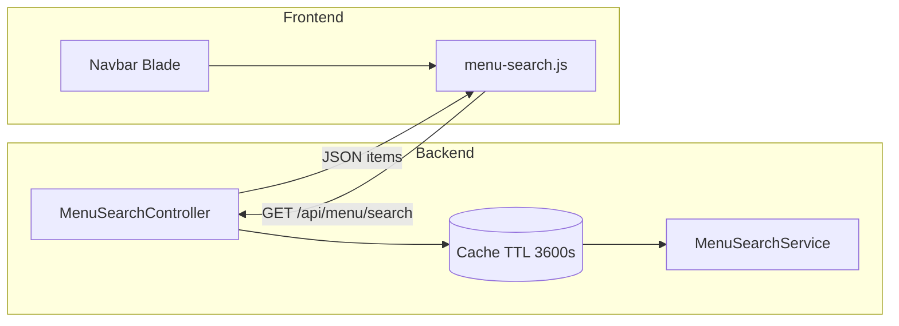

# Menu Search Feature – Implementation Reference

**Purpose**: Portable specification for copying or re-implementing a **navbar menu search** (permission-aware autocomplete) into another Laravel + AdminLTE (or similar) project.

**Source stack (this codebase)**: Laravel 12, Blade, AdminLTE 3 / Bootstrap 4, jQuery, Spatie Laravel Permission (`can`, `hasAnyPermission`), session/web auth.

**Last aligned with codebase**: Sarange ERP (see `routes/api.php`, `app/Services/MenuSearchService.php`, `public/js/menu-search.js`). **2026-06-25**: added **FIFO Layer Repair** (`inventory.adjust` → `inventory.fifo-repair.index`).

---

## Feature summary

Users type in a search field on the **top navbar**. The UI loads a JSON list of **menu destinations the current user may access**, then filters client-side as they type (debounced). Selecting a row navigates to that URL. Matching respects **titles, breadcrumbs, and optional keywords** stored per item.

**UX details (this project)**:

- Placeholder text: configurable (e.g. `Search Menu here`).
- Optional visible `<label>` above the field (styling via `.menu-search-label` in CSS); navbar may ship with label commented out—in that case rely on placeholder + `aria-label`.
- Responsive: container often hidden below `md` (`d-none d-md-flex`).
- Shortcut: Ctrl+K / Cmd+K focuses `#menu-search-input` (implemented in `menu-search.js`).
- Keyboard: ArrowUp/ArrowDown, Enter to go, Escape to dismiss.

---

## Architecture (high level)



1. **`MenuSearchService`**: Builds a flat array of `{ title, route, icon, category, breadcrumb, keywords?, searchText }` using the same permission rules as your sidebar would use (explicit `can` / `hasAnyPermission`).
2. **`MenuSearchController`**: Authenticated JSON endpoint; caches the **full list per user + permission fingerprint** for 3600 seconds; optionally applies `q` query with server-side filter (frontend in this repo filters locally after fetch).
3. **`menu-search.js`**: Loads items once via AJAX into `allMenuItems`, filters into `filteredItems`, renders `.menu-search-item` rows, navigates via `window.location.href`.

---

## Files (this repository)

| Role | Path |
|------|------|
| Service | `app/Services/MenuSearchService.php` |
| Controller | `app/Http/Controllers/Api/MenuSearchController.php` |
| Route | `routes/api.php` – `GET /menu/search` inside `middleware(['web', 'auth'])` group |
| Layout – markup | `resources/views/layouts/partials/navbar.blade.php` – `#menu-search-container` |
| Styles | `public/css/menu-search.css` |
| Script | `public/js/menu-search.js` |
| Head include | `resources/views/layouts/partials/head.blade.php` – link to `css/menu-search.css` |
| Scripts include | `resources/views/layouts/partials/scripts.blade.php` – `js/menu-search.js` after jQuery |

**Why `web` middleware on `/api/menu/search`**: Session cookie auth matches typical Blade apps; SPA/Sanctum-only apps would use different middleware.

---

## HTTP API contract

**Request**

```http
GET /api/menu/search HTTP/1.1
Cookie: laravel_session=...
X-Requested-With: XMLHttpRequest
```

Optional query:

- `q` – if non-empty, server returns up to **15** items substring-matched on concatenated searchable text (implemented in controller).

**Success response** (`200`)

```json
{
  "items": [
    {
      "title": "Inventory Items",
      "route": "https://example.test/inventory",
      "icon": "fas fa-boxes",
      "category": "Inventory",
      "breadcrumb": "MAIN > Inventory > Inventory Items",
      "keywords": ["inventory", "items", "stock", "products"],
      "searchText": "inventory items main > inventory > inventory items inventory items stock products"
    }
  ]
}
```

**Notes**

- `route` should be absolute or path your browser can follow (`route()` URLs are fine).
- `searchText` is lowercased; client filters with `searchText.indexOf(term)`.

**Caching**

```text
cache key: menu_items_user_{userId}_{md5(sorted permission names)}
TTL:       3600 seconds
```

If permissions or menu definitions change rarely, TTL is acceptable. If roles change often in-session, invalidate this cache when permissions are updated—or reduce TTL.

---

## Required DOM (navbar markup)

Minimal structure expected by JavaScript:

```html
<div id="menu-search-container" class="d-none d-md-flex">
    <div id="menu-search-input-wrapper">
        <!-- optional -->
        <!-- <label for="menu-search-input" class="menu-search-label">Search Menu here</label> -->
        <input type="text" id="menu-search-input" class="form-control" placeholder="Search Menu here"
            autocomplete="off" aria-label="Search menu">
        <i id="menu-search-icon" class="fas fa-search"></i>
    </div>
    <div id="menu-search-results"></div>
</div>
```

- `#menu-search-results` holds dynamically injected `.menu-search-item` rows.
- Script URL is hard-coded as **`/api/menu/search`**—if your app uses a URL prefix or subdomain, refactor to a Blade variable or `<meta>` tag.

---

## Permission model

Implementation mirrors sidebar rules in PHP—not by parsing Blade. For each navigable leaf:

1. Wrap groups in `hasAnyPermission([...])` where `@canany` applies in sidebar.
2. Wrap individual entries in `can('permission.name')` where `@can` applies.

Adding a sidebar link without updating `MenuSearchService` hides it from search but not from sidebar (drift risk). Treat the service as a **second source of truth** unless you refactor to generate one menu definition for both Blade and JSON.

---

## Porting checklist (another project)

1. **Backend**
   - [ ] Implement a service that outputs the same JSON shape as above, filtered by your auth (Gates, Policies, Spatie, or custom).
   - [ ] Expose `GET /api/menu/search` (or one URL; update JS to match) with session auth.
   - [ ] Add caching key that changes when user permissions change.
2. **Frontend**
   - [ ] Ensure jQuery loads before `menu-search.js`.
   - [ ] Copy `menu-search.js` and `menu-search.css`; adjust colors for your navbar theme.
   - [ ] Insert navbar HTML; match element IDs.
3. **Consistency**
   - [ ] Every new route in sidebar: add an entry in the menu service (or automate generation).
4. **Security**
   - [ ] Never return URLs the user cannot access; enforce same checks as route middleware.
5. **Optional**
   - [ ] Internationalization: translate `title` / `breadcrumb` in the service or use `__()`.
   - [ ] Use `?q=` only on server if you want server-side search for very large menus; client-side is simpler for hundreds of items.

---

## Styling notes

`public/css/menu-search.css` styles:

- White input field on dark navbar (`#menu-search-input` with `#fff` background).
- Dropdown `#menu-search-results` as light panel with z-index above content.
- Icon positioned inside the input wrapper (absolute `right` / `bottom`).

Adjust for **light navbars** using `.navbar-light` overrides already present in the same file.

---

## Testing ideas

- Log in as users with different roles; confirm item count and absence of forbidden URLs.
- Type partial strings; confirm ordering (title match preference in JS).
- Keyboard: focus, arrows, Enter, Escape.
- Mobile: confirm hidden or alternate entry if `d-none d-md-flex` is kept.

---

## Related internal docs

- Architecture overview: [architecture.md](architecture.md) (Navigation features, Menu Search section).
- Decision record: [decisions.md](decisions.md) (Menu Search Bar Implementation – 2026-02-04).
- Memory entry: [MEMORY.md](../MEMORY.md) entry `[080]` (summary).

---

## License / reuse

This reference describes patterns used in Sarange ERP. Adapt file paths, permission names, and routes to your application; no external dependencies beyond Laravel, jQuery, and (optional) Spatie Permission are required for the same pattern.
